**Data Sample:** 

* Juvenile intake complaints with intake dates from July 1, 2015 - June 30, 2021

* Dispositions – all dispositions for the intake complaints in the sample. 


**Research Question:**

Conduct a front-end system assessment from intake through petition for all complaints 2016-2021.


**Methods:**

We will conduct a descriptive analysis of the front end of the system from intake through petition, provide unadjusted counts, RRI’s and means tests where applicable, by race, sex, offense, risk, CSU, and year for:

*	Complaints

*	Intake decisions: divert, resolve, petition, other

*	Average LOS on diversion 

*	Diversion completions: successful, unsuccessful, other

*	Dispositions on petitioned cases

*Cohort:* All complaints from 2016-2021  

<br>


# Tables (Descriptives)

## Table 1: Intake Decisions by Race/Ethnicity

**Note:** I am currently coding the following intake decisions as 'Diverted': "UNSUCCESSFUL DIVERSION/PETITION FILED" (code of '18'), "SUCCESSFUL DIVERSION" (code of '20'), "UNSUCCESSFUL DIVERSION/NO PETITION FILED" (code of '21'), and "REQ'D TO PARTICIPATE-DIVERSION" (code of '7'). All other intake decisions are coded as "Not Diverted". See preliminary coding of intake decisions in `Intake Complaints, Intake Decision Descriptions` table on `codebook` page in `sample descriptives` tab


::: {.cell .column-page-right}
::: {.cell-output-display}
`````{=html}
<table class="table table-striped table-hover table-condensed table-responsive" style="margin-left: auto; margin-right: auto;">
 <thead>
  <tr>
   <th style="text-align:center;"> Race/Ethnicity </th>
   <th style="text-align:center;"> All Complaints (N) </th>
   <th style="text-align:center;"> All Complaints (column %) </th>
   <th style="text-align:center;"> Complaints Petitioned (N) </th>
   <th style="text-align:center;"> Complaints Petitioned (row %) </th>
   <th style="text-align:center;"> Complaints Diverted (N) </th>
   <th style="text-align:center;"> Complaints Diverted (row %) </th>
   <th style="text-align:center;"> Complaints Resolved/Dismissed (N) </th>
   <th style="text-align:center;"> Complaints Resolved/Dismissed (row %) </th>
   <th style="text-align:center;"> Other (N) </th>
   <th style="text-align:center;"> Other (row %) </th>
  </tr>
 </thead>
<tbody>
  <tr>
   <td style="text-align:center;"> American Indian </td>
   <td style="text-align:center;"> 188 </td>
   <td style="text-align:center;"> 0.1% </td>
   <td style="text-align:center;"> 117 </td>
   <td style="text-align:center;"> 62.2% </td>
   <td style="text-align:center;"> 45 </td>
   <td style="text-align:center;"> 23.9% </td>
   <td style="text-align:center;"> 17 </td>
   <td style="text-align:center;"> 9.0% </td>
   <td style="text-align:center;"> 3 </td>
   <td style="text-align:center;"> 1.6% </td>
  </tr>
  <tr>
   <td style="text-align:center;"> Asian </td>
   <td style="text-align:center;"> 1,935 </td>
   <td style="text-align:center;"> 1.0% </td>
   <td style="text-align:center;"> 1,086 </td>
   <td style="text-align:center;"> 56.1% </td>
   <td style="text-align:center;"> 440 </td>
   <td style="text-align:center;"> 22.7% </td>
   <td style="text-align:center;"> 206 </td>
   <td style="text-align:center;"> 10.6% </td>
   <td style="text-align:center;"> 30 </td>
   <td style="text-align:center;"> 1.6% </td>
  </tr>
  <tr>
   <td style="text-align:center;"> Black </td>
   <td style="text-align:center;"> 81,336 </td>
   <td style="text-align:center;"> 41.1% </td>
   <td style="text-align:center;"> 57,368 </td>
   <td style="text-align:center;"> 70.5% </td>
   <td style="text-align:center;"> 12,248 </td>
   <td style="text-align:center;"> 15.1% </td>
   <td style="text-align:center;"> 7,017 </td>
   <td style="text-align:center;"> 8.6% </td>
   <td style="text-align:center;"> 1,584 </td>
   <td style="text-align:center;"> 1.9% </td>
  </tr>
  <tr>
   <td style="text-align:center;"> Hispanic </td>
   <td style="text-align:center;"> 21,416 </td>
   <td style="text-align:center;"> 10.8% </td>
   <td style="text-align:center;"> 14,205 </td>
   <td style="text-align:center;"> 66.3% </td>
   <td style="text-align:center;"> 3,913 </td>
   <td style="text-align:center;"> 18.3% </td>
   <td style="text-align:center;"> 1,891 </td>
   <td style="text-align:center;"> 8.8% </td>
   <td style="text-align:center;"> 393 </td>
   <td style="text-align:center;"> 1.8% </td>
  </tr>
  <tr>
   <td style="text-align:center;"> White </td>
   <td style="text-align:center;"> 79,782 </td>
   <td style="text-align:center;"> 40.3% </td>
   <td style="text-align:center;"> 53,177 </td>
   <td style="text-align:center;"> 66.7% </td>
   <td style="text-align:center;"> 17,250 </td>
   <td style="text-align:center;"> 21.6% </td>
   <td style="text-align:center;"> 5,766 </td>
   <td style="text-align:center;"> 7.2% </td>
   <td style="text-align:center;"> 728 </td>
   <td style="text-align:center;"> 0.9% </td>
  </tr>
  <tr>
   <td style="text-align:center;"> Other </td>
   <td style="text-align:center;"> 11,777 </td>
   <td style="text-align:center;"> 6.0% </td>
   <td style="text-align:center;"> 6,951 </td>
   <td style="text-align:center;"> 59.0% </td>
   <td style="text-align:center;"> 2,854 </td>
   <td style="text-align:center;"> 24.2% </td>
   <td style="text-align:center;"> 1,309 </td>
   <td style="text-align:center;"> 11.1% </td>
   <td style="text-align:center;"> 138 </td>
   <td style="text-align:center;"> 1.2% </td>
  </tr>
  <tr>
   <td style="text-align:center;"> NA </td>
   <td style="text-align:center;"> 1,390 </td>
   <td style="text-align:center;"> 0.7% </td>
   <td style="text-align:center;"> 673 </td>
   <td style="text-align:center;"> 48.4% </td>
   <td style="text-align:center;"> 419 </td>
   <td style="text-align:center;"> 30.1% </td>
   <td style="text-align:center;"> 220 </td>
   <td style="text-align:center;"> 15.8% </td>
   <td style="text-align:center;"> 19 </td>
   <td style="text-align:center;"> 1.4% </td>
  </tr>
  <tr>
   <td style="text-align:center;font-weight: bold;"> Overall </td>
   <td style="text-align:center;font-weight: bold;"> 197,824 </td>
   <td style="text-align:center;font-weight: bold;"> 100.0% </td>
   <td style="text-align:center;font-weight: bold;"> 133,577 </td>
   <td style="text-align:center;font-weight: bold;"> 67.5% </td>
   <td style="text-align:center;font-weight: bold;"> 37,169 </td>
   <td style="text-align:center;font-weight: bold;"> 18.8% </td>
   <td style="text-align:center;font-weight: bold;"> 16,426 </td>
   <td style="text-align:center;font-weight: bold;"> 8.3% </td>
   <td style="text-align:center;font-weight: bold;"> 2,895 </td>
   <td style="text-align:center;font-weight: bold;"> 1.5% </td>
  </tr>
</tbody>
</table>

`````
:::
:::


<br>

## Table 2: Disposition Outcomes by Race/Ethnicity

Note: The preliminary options for grouping dispositions that I am using are: Detention, Commitment, Probation/Supervision, Deferral, Community Service, Fine, No further action/none, Restitution, Other. See the `Disposition, Preliminary Disposition Groupings` table on the `codebook` page in the `sample descriptives` tab for a full list of each disposition and I've grouped it. 


::: {.cell .column-page-right}
::: {.cell-output-display}
`````{=html}
<table class="table table-striped table-hover table-condensed table-responsive" style="margin-left: auto; margin-right: auto;">
 <thead>
  <tr>
   <th style="text-align:center;"> Race/Ethnicity </th>
   <th style="text-align:center;"> All Disposed Complaints (N) </th>
   <th style="text-align:center;"> All Disposed Complaints (column %) </th>
   <th style="text-align:center;"> Detention (N) </th>
   <th style="text-align:center;"> Detention (row %) </th>
   <th style="text-align:center;"> Commitment (N) </th>
   <th style="text-align:center;"> Commitment (row %) </th>
   <th style="text-align:center;"> Probation/Supervision (N) </th>
   <th style="text-align:center;"> Probation/Supervision (row %) </th>
   <th style="text-align:center;"> Deferral (N) </th>
   <th style="text-align:center;"> Deferral (row %) </th>
   <th style="text-align:center;"> Community Service (N) </th>
   <th style="text-align:center;"> Community Service (row %) </th>
   <th style="text-align:center;"> Fine (N) </th>
   <th style="text-align:center;"> Fine (row %) </th>
   <th style="text-align:center;"> No further action/none (N) </th>
   <th style="text-align:center;"> No further action/none (row %) </th>
   <th style="text-align:center;"> Restitution (N) </th>
   <th style="text-align:center;"> Restitution (row %) </th>
   <th style="text-align:center;"> Other (N) </th>
   <th style="text-align:center;"> Other (row %) </th>
  </tr>
 </thead>
<tbody>
  <tr>
   <td style="text-align:center;"> American Indian </td>
   <td style="text-align:center;"> 188 </td>
   <td style="text-align:center;"> 0.1% </td>
   <td style="text-align:center;"> 7 </td>
   <td style="text-align:center;"> 3.7% </td>
   <td style="text-align:center;"> 3 </td>
   <td style="text-align:center;"> 1.6% </td>
   <td style="text-align:center;"> 53 </td>
   <td style="text-align:center;"> 28.2% </td>
   <td style="text-align:center;"> 3 </td>
   <td style="text-align:center;"> 1.6% </td>
   <td style="text-align:center;"> 3 </td>
   <td style="text-align:center;"> 1.6% </td>
   <td style="text-align:center;"> 2 </td>
   <td style="text-align:center;"> 1.1% </td>
   <td style="text-align:center;"> 1 </td>
   <td style="text-align:center;"> 0.5% </td>
   <td style="text-align:center;"> 2 </td>
   <td style="text-align:center;"> 1.1% </td>
   <td style="text-align:center;"> 2 </td>
   <td style="text-align:center;"> 1.1% </td>
  </tr>
  <tr>
   <td style="text-align:center;"> Asian </td>
   <td style="text-align:center;"> 1,935 </td>
   <td style="text-align:center;"> 1.0% </td>
   <td style="text-align:center;"> 43 </td>
   <td style="text-align:center;"> 2.2% </td>
   <td style="text-align:center;"> 12 </td>
   <td style="text-align:center;"> 0.6% </td>
   <td style="text-align:center;"> 411 </td>
   <td style="text-align:center;"> 21.2% </td>
   <td style="text-align:center;"> 14 </td>
   <td style="text-align:center;"> 0.7% </td>
   <td style="text-align:center;"> 39 </td>
   <td style="text-align:center;"> 2.0% </td>
   <td style="text-align:center;"> 10 </td>
   <td style="text-align:center;"> 0.5% </td>
   <td style="text-align:center;"> 11 </td>
   <td style="text-align:center;"> 0.6% </td>
   <td style="text-align:center;"> 4 </td>
   <td style="text-align:center;"> 0.2% </td>
   <td style="text-align:center;"> 19 </td>
   <td style="text-align:center;"> 1.0% </td>
  </tr>
  <tr>
   <td style="text-align:center;"> Black </td>
   <td style="text-align:center;"> 81,336 </td>
   <td style="text-align:center;"> 41.1% </td>
   <td style="text-align:center;"> 4,893 </td>
   <td style="text-align:center;"> 6.0% </td>
   <td style="text-align:center;"> 2,359 </td>
   <td style="text-align:center;"> 2.9% </td>
   <td style="text-align:center;"> 20,921 </td>
   <td style="text-align:center;"> 25.7% </td>
   <td style="text-align:center;"> 890 </td>
   <td style="text-align:center;"> 1.1% </td>
   <td style="text-align:center;"> 1,499 </td>
   <td style="text-align:center;"> 1.8% </td>
   <td style="text-align:center;"> 451 </td>
   <td style="text-align:center;"> 0.6% </td>
   <td style="text-align:center;"> 649 </td>
   <td style="text-align:center;"> 0.8% </td>
   <td style="text-align:center;"> 275 </td>
   <td style="text-align:center;"> 0.3% </td>
   <td style="text-align:center;"> 1,500 </td>
   <td style="text-align:center;"> 1.8% </td>
  </tr>
  <tr>
   <td style="text-align:center;"> Hispanic </td>
   <td style="text-align:center;"> 21,416 </td>
   <td style="text-align:center;"> 10.8% </td>
   <td style="text-align:center;"> 1,281 </td>
   <td style="text-align:center;"> 6.0% </td>
   <td style="text-align:center;"> 269 </td>
   <td style="text-align:center;"> 1.3% </td>
   <td style="text-align:center;"> 5,187 </td>
   <td style="text-align:center;"> 24.2% </td>
   <td style="text-align:center;"> 149 </td>
   <td style="text-align:center;"> 0.7% </td>
   <td style="text-align:center;"> 356 </td>
   <td style="text-align:center;"> 1.7% </td>
   <td style="text-align:center;"> 204 </td>
   <td style="text-align:center;"> 1.0% </td>
   <td style="text-align:center;"> 265 </td>
   <td style="text-align:center;"> 1.2% </td>
   <td style="text-align:center;"> 31 </td>
   <td style="text-align:center;"> 0.1% </td>
   <td style="text-align:center;"> 200 </td>
   <td style="text-align:center;"> 0.9% </td>
  </tr>
  <tr>
   <td style="text-align:center;"> White </td>
   <td style="text-align:center;"> 79,782 </td>
   <td style="text-align:center;"> 40.3% </td>
   <td style="text-align:center;"> 3,582 </td>
   <td style="text-align:center;"> 4.5% </td>
   <td style="text-align:center;"> 698 </td>
   <td style="text-align:center;"> 0.9% </td>
   <td style="text-align:center;"> 20,526 </td>
   <td style="text-align:center;"> 25.7% </td>
   <td style="text-align:center;"> 789 </td>
   <td style="text-align:center;"> 1.0% </td>
   <td style="text-align:center;"> 2,220 </td>
   <td style="text-align:center;"> 2.8% </td>
   <td style="text-align:center;"> 624 </td>
   <td style="text-align:center;"> 0.8% </td>
   <td style="text-align:center;"> 345 </td>
   <td style="text-align:center;"> 0.4% </td>
   <td style="text-align:center;"> 165 </td>
   <td style="text-align:center;"> 0.2% </td>
   <td style="text-align:center;"> 1,083 </td>
   <td style="text-align:center;"> 1.4% </td>
  </tr>
  <tr>
   <td style="text-align:center;"> Other </td>
   <td style="text-align:center;"> 11,777 </td>
   <td style="text-align:center;"> 6.0% </td>
   <td style="text-align:center;"> 364 </td>
   <td style="text-align:center;"> 3.1% </td>
   <td style="text-align:center;"> 102 </td>
   <td style="text-align:center;"> 0.9% </td>
   <td style="text-align:center;"> 2,255 </td>
   <td style="text-align:center;"> 19.1% </td>
   <td style="text-align:center;"> 102 </td>
   <td style="text-align:center;"> 0.9% </td>
   <td style="text-align:center;"> 329 </td>
   <td style="text-align:center;"> 2.8% </td>
   <td style="text-align:center;"> 97 </td>
   <td style="text-align:center;"> 0.8% </td>
   <td style="text-align:center;"> 65 </td>
   <td style="text-align:center;"> 0.6% </td>
   <td style="text-align:center;"> 19 </td>
   <td style="text-align:center;"> 0.2% </td>
   <td style="text-align:center;"> 136 </td>
   <td style="text-align:center;"> 1.2% </td>
  </tr>
  <tr>
   <td style="text-align:center;"> NA </td>
   <td style="text-align:center;"> 1,390 </td>
   <td style="text-align:center;"> 0.7% </td>
   <td style="text-align:center;"> 15 </td>
   <td style="text-align:center;"> 1.1% </td>
   <td style="text-align:center;"> 1 </td>
   <td style="text-align:center;"> 0.1% </td>
   <td style="text-align:center;"> 155 </td>
   <td style="text-align:center;"> 11.2% </td>
   <td style="text-align:center;"> 16 </td>
   <td style="text-align:center;"> 1.2% </td>
   <td style="text-align:center;"> 52 </td>
   <td style="text-align:center;"> 3.7% </td>
   <td style="text-align:center;"> 26 </td>
   <td style="text-align:center;"> 1.9% </td>
   <td style="text-align:center;"> 5 </td>
   <td style="text-align:center;"> 0.4% </td>
   <td style="text-align:center;"> 1 </td>
   <td style="text-align:center;"> 0.1% </td>
   <td style="text-align:center;"> 28 </td>
   <td style="text-align:center;"> 2.0% </td>
  </tr>
  <tr>
   <td style="text-align:center;font-weight: bold;"> Overall </td>
   <td style="text-align:center;font-weight: bold;"> 197,824 </td>
   <td style="text-align:center;font-weight: bold;"> 100.0% </td>
   <td style="text-align:center;font-weight: bold;"> 10,179 </td>
   <td style="text-align:center;font-weight: bold;"> 5.1% </td>
   <td style="text-align:center;font-weight: bold;"> 3,438 </td>
   <td style="text-align:center;font-weight: bold;"> 1.7% </td>
   <td style="text-align:center;font-weight: bold;"> 49,502 </td>
   <td style="text-align:center;font-weight: bold;"> 25.0% </td>
   <td style="text-align:center;font-weight: bold;"> 1,957 </td>
   <td style="text-align:center;font-weight: bold;"> 1.0% </td>
   <td style="text-align:center;font-weight: bold;"> 4,492 </td>
   <td style="text-align:center;font-weight: bold;"> 2.3% </td>
   <td style="text-align:center;font-weight: bold;"> 1,408 </td>
   <td style="text-align:center;font-weight: bold;"> 0.7% </td>
   <td style="text-align:center;font-weight: bold;"> 1,335 </td>
   <td style="text-align:center;font-weight: bold;"> 0.7% </td>
   <td style="text-align:center;font-weight: bold;"> 491 </td>
   <td style="text-align:center;font-weight: bold;"> 0.2% </td>
   <td style="text-align:center;font-weight: bold;"> 2,962 </td>
   <td style="text-align:center;font-weight: bold;"> 1.5% </td>
  </tr>
</tbody>
</table>

`````
:::
:::


<br>

## Table 3: Average Length of Stay on Diversion by Race/Ethnicity

Both measures of LOS on diversion are calculated by DJJ and provided in the `caseload` file -- see codebook page for more information. The two LOS measures are the "Number of days on the workload status "Diversion at Intake" and the "Number of days on the workload status "Diversion Beyond 90 Days"


::: {.cell .column-page-right}
::: {.cell-output-display}
`````{=html}
<table class="table table-striped table-hover table-condensed table-responsive" style="margin-left: auto; margin-right: auto;">
 <thead>
  <tr>
   <th style="text-align:center;"> Race/Ethnicity </th>
   <th style="text-align:center;"> Mean Diversion LOS (at intake) </th>
   <th style="text-align:center;"> Median Diversion LOS (at intake) </th>
   <th style="text-align:center;"> Mean Diversion LOS (beyond 90 days) </th>
   <th style="text-align:center;"> Median Diversion LOS (beyond 90 days) </th>
  </tr>
 </thead>
<tbody>
  <tr>
   <td style="text-align:center;"> American Indian </td>
   <td style="text-align:center;"> 14.50000 </td>
   <td style="text-align:center;"> 0 </td>
   <td style="text-align:center;"> 0.0053191 </td>
   <td style="text-align:center;"> 0 </td>
  </tr>
  <tr>
   <td style="text-align:center;"> Asian </td>
   <td style="text-align:center;"> 13.20000 </td>
   <td style="text-align:center;"> 0 </td>
   <td style="text-align:center;"> 0.0087855 </td>
   <td style="text-align:center;"> 0 </td>
  </tr>
  <tr>
   <td style="text-align:center;"> Black </td>
   <td style="text-align:center;"> 10.63666 </td>
   <td style="text-align:center;"> 0 </td>
   <td style="text-align:center;"> 0.0072907 </td>
   <td style="text-align:center;"> 0 </td>
  </tr>
  <tr>
   <td style="text-align:center;"> Hispanic </td>
   <td style="text-align:center;"> 11.46970 </td>
   <td style="text-align:center;"> 0 </td>
   <td style="text-align:center;"> 0.0029417 </td>
   <td style="text-align:center;"> 0 </td>
  </tr>
  <tr>
   <td style="text-align:center;"> White </td>
   <td style="text-align:center;"> 15.85843 </td>
   <td style="text-align:center;"> 0 </td>
   <td style="text-align:center;"> 0.0054398 </td>
   <td style="text-align:center;"> 0 </td>
  </tr>
  <tr>
   <td style="text-align:center;"> Other </td>
   <td style="text-align:center;"> 17.03040 </td>
   <td style="text-align:center;"> 0 </td>
   <td style="text-align:center;"> 0.0067080 </td>
   <td style="text-align:center;"> 0 </td>
  </tr>
  <tr>
   <td style="text-align:center;"> NA </td>
   <td style="text-align:center;"> 21.76115 </td>
   <td style="text-align:center;"> 0 </td>
   <td style="text-align:center;"> 0.0064748 </td>
   <td style="text-align:center;"> 0 </td>
  </tr>
  <tr>
   <td style="text-align:center;font-weight: bold;"> Overall </td>
   <td style="text-align:center;font-weight: bold;"> 13.32032 </td>
   <td style="text-align:center;font-weight: bold;"> 0 </td>
   <td style="text-align:center;font-weight: bold;"> 0.0060458 </td>
   <td style="text-align:center;font-weight: bold;"> 0 </td>
  </tr>
</tbody>
</table>

`````
:::
:::


<br>

# Tables (Unadjusted Relative Rate Indices)

The Relative Rate Index (RRI) provides a measure of disparity or disproportionality in outcomes by comparing the rates at which individuals of different races/ethnic groups experience supervision and revocation. To calculate the RRI, the rate of each outcome of interest for youth who are Black and Hispanic is divided by the rate at which the outcome occurs for youth who are White. 

A RRI of 1 indicates no disparity. RRIs greater than 1 indicate the outcome occurs more frequently for youth who are Black or Hispanic, and an RRI less than 1 indicates an outcome occurs less frequently than for youth who are White. All rates are calculated at the individual level (should we limit to youth with no prior JJ history if we keep this analysis at the individual-level as opposed to complaint/case-level?).


* Relative rate index, JJ population (using Virginia youth population data as denominator)

* Relative rate index, diversion and petition (using overall Virginia JJ sample data as denominator)

* Relative rate index, informal diversion (i.e. referred to other agency) and dismissal (using overall Virginia JJ sample data as denominator)

* Relative rate index, diversion outcomes (using Virginia JJ diversion sample data as denominator)

<br>

## Table 4: Overall JJ Population, RRI


::: {.cell .column-page-right}
::: {.cell-output-display}
`````{=html}
<table class="table table-striped table-hover table-condensed table-responsive" style="margin-left: auto; margin-right: auto;">
 <thead>
  <tr>
   <th style="text-align:center;"> Race/Ethnicity </th>
   <th style="text-align:center;"> Unique Youth (N) </th>
   <th style="text-align:center;"> JJ-involved Rate (per 10k youth) </th>
   <th style="text-align:center;"> JJ-involved RRI (to white youth) </th>
  </tr>
 </thead>
<tbody>
  <tr>
   <td style="text-align:center;"> White </td>
   <td style="text-align:center;"> 43,415 </td>
   <td style="text-align:center;"> 723.2193 </td>
   <td style="text-align:center;"> NA </td>
  </tr>
  <tr>
   <td style="text-align:center;"> American Indian </td>
   <td style="text-align:center;"> 108 </td>
   <td style="text-align:center;"> 371.1340 </td>
   <td style="text-align:center;"> 0.51 </td>
  </tr>
  <tr>
   <td style="text-align:center;"> Asian </td>
   <td style="text-align:center;"> 1,225 </td>
   <td style="text-align:center;"> 152.8480 </td>
   <td style="text-align:center;"> 0.21 </td>
  </tr>
  <tr>
   <td style="text-align:center;"> Black </td>
   <td style="text-align:center;"> 34,470 </td>
   <td style="text-align:center;"> 1,493.8180 </td>
   <td style="text-align:center;"> 2.07 </td>
  </tr>
  <tr>
   <td style="text-align:center;"> Hispanic </td>
   <td style="text-align:center;"> 9,377 </td>
   <td style="text-align:center;"> 696.8690 </td>
   <td style="text-align:center;"> 0.96 </td>
  </tr>
  <tr>
   <td style="text-align:center;"> Other </td>
   <td style="text-align:center;"> 7,836 </td>
   <td style="text-align:center;"> NA </td>
   <td style="text-align:center;"> NA </td>
  </tr>
</tbody>
</table>

`````
:::
:::


<br>

## Table 5: Diversion and Petition Rate, RRI

**Question:** Should we limit to youth with no prior JJ history if we keep this analysis at the individual-level as opposed to complaint/case-level? Otherwise, how would we create a youth-level measure of diversion decisions? I am currently filtering on youth with no prior JJ history. I have also filtered out youth whose charge is a technical violation (not sure why they are listed as not having JJ history?)

**NOTE:** I am currently only include "formal" diversions in the count of unique youth diverted. The denominator used is all youth in the DJJ sample without prior JJ history.


::: {.cell .column-page-right}
::: {.cell-output-display}
`````{=html}
<table class="table table-striped table-hover table-condensed table-responsive" style="margin-left: auto; margin-right: auto;">
 <thead>
  <tr>
   <th style="text-align:center;"> Race/Ethnicity </th>
   <th style="text-align:center;"> Unique Youth, no prior JJ history (N) </th>
   <th style="text-align:center;"> Unique Youth Diverted, no prior JJ history (N) </th>
   <th style="text-align:center;"> Diversion Rate (per 10k JJ-involved youth w/ no prior JJ history) </th>
   <th style="text-align:center;"> Diversion RRI (to white youth) </th>
   <th style="text-align:center;"> Unique Youth Petitioned, no prior JJ history (N) </th>
   <th style="text-align:center;"> Petition Rate (per 10k JJ-involved youth w/ no prior JJ history) </th>
   <th style="text-align:center;"> Petition RRI (to white youth) </th>
  </tr>
 </thead>
<tbody>
  <tr>
   <td style="text-align:center;"> American Indian </td>
   <td style="text-align:center;"> 95 </td>
   <td style="text-align:center;"> 31 </td>
   <td style="text-align:center;"> 3,263.158 </td>
   <td style="text-align:center;"> 0.90 </td>
   <td style="text-align:center;"> 46 </td>
   <td style="text-align:center;"> 4,842.105 </td>
   <td style="text-align:center;"> 1.01 </td>
  </tr>
  <tr>
   <td style="text-align:center;"> Asian </td>
   <td style="text-align:center;"> 1,114 </td>
   <td style="text-align:center;"> 371 </td>
   <td style="text-align:center;"> 3,330.341 </td>
   <td style="text-align:center;"> 0.92 </td>
   <td style="text-align:center;"> 442 </td>
   <td style="text-align:center;"> 3,967.684 </td>
   <td style="text-align:center;"> 0.83 </td>
  </tr>
  <tr>
   <td style="text-align:center;"> Black </td>
   <td style="text-align:center;"> 26,704 </td>
   <td style="text-align:center;"> 8,577 </td>
   <td style="text-align:center;"> 3,211.878 </td>
   <td style="text-align:center;"> 0.88 </td>
   <td style="text-align:center;"> 12,168 </td>
   <td style="text-align:center;"> 4,556.621 </td>
   <td style="text-align:center;"> 0.95 </td>
  </tr>
  <tr>
   <td style="text-align:center;"> Hispanic </td>
   <td style="text-align:center;"> 7,975 </td>
   <td style="text-align:center;"> 2,813 </td>
   <td style="text-align:center;"> 3,527.273 </td>
   <td style="text-align:center;"> 0.97 </td>
   <td style="text-align:center;"> 3,257 </td>
   <td style="text-align:center;"> 4,084.013 </td>
   <td style="text-align:center;"> 0.85 </td>
  </tr>
  <tr>
   <td style="text-align:center;"> White </td>
   <td style="text-align:center;"> 36,633 </td>
   <td style="text-align:center;"> 13,303 </td>
   <td style="text-align:center;"> 3,631.425 </td>
   <td style="text-align:center;"> NA </td>
   <td style="text-align:center;"> 17,550 </td>
   <td style="text-align:center;"> 4,790.762 </td>
   <td style="text-align:center;"> NA </td>
  </tr>
  <tr>
   <td style="text-align:center;"> Other </td>
   <td style="text-align:center;"> 7,220 </td>
   <td style="text-align:center;"> 2,379 </td>
   <td style="text-align:center;"> 3,295.014 </td>
   <td style="text-align:center;"> 0.91 </td>
   <td style="text-align:center;"> 3,375 </td>
   <td style="text-align:center;"> 4,674.515 </td>
   <td style="text-align:center;"> 0.98 </td>
  </tr>
</tbody>
</table>

`````
:::
:::


<br>

## Table 6: Informal Diversion and Resolved/Dismissed Rate, RRI

**Question:** Should we limit to youth with no prior JJ history if we keep this analysis at the individual-level as opposed to complaint/case-level? Otherwise, how would we create a youth-level measure of diversion decisions? I am currently filtering on youth with no prior JJ history. I have also filtered out youth whose charge is a technical violation (not sure why they are listed as not having JJ history?)

**NOTE:** I am currently only include "formal" diversions in the count of unique youth diverted. The denominator used is all youth in the DJJ sample without prior JJ history.


::: {.cell .column-page-right}
::: {.cell-output-display}
`````{=html}
<table class="table table-striped table-hover table-condensed table-responsive" style="margin-left: auto; margin-right: auto;">
 <thead>
  <tr>
   <th style="text-align:center;"> Race/Ethnicity </th>
   <th style="text-align:center;"> Unique Youth, no prior JJ history (N) </th>
   <th style="text-align:center;"> Unique Youth Diverted (Informal), no prior JJ history (N) </th>
   <th style="text-align:center;"> Diversion (Informal) Rate (per 10k JJ-involved youth w/ no prior JJ history) </th>
   <th style="text-align:center;"> Diversion (Informal) RRI (to white youth) </th>
   <th style="text-align:center;"> Unique Youth Resolved/Dismissed, no prior JJ history (N) </th>
   <th style="text-align:center;"> Resolved/Dismissed Rate (per 10k JJ-involved youth w/ no prior JJ history) </th>
   <th style="text-align:center;"> Resolved/Dismissed RRI (to white youth) </th>
  </tr>
 </thead>
<tbody>
  <tr>
   <td style="text-align:center;"> American Indian </td>
   <td style="text-align:center;"> 95 </td>
   <td style="text-align:center;"> 5 </td>
   <td style="text-align:center;"> 526.3158 </td>
   <td style="text-align:center;"> 1.02 </td>
   <td style="text-align:center;"> 11 </td>
   <td style="text-align:center;"> 1,157.8947 </td>
   <td style="text-align:center;"> 1.16 </td>
  </tr>
  <tr>
   <td style="text-align:center;"> Asian </td>
   <td style="text-align:center;"> 1,114 </td>
   <td style="text-align:center;"> 134 </td>
   <td style="text-align:center;"> 1,202.8725 </td>
   <td style="text-align:center;"> 2.33 </td>
   <td style="text-align:center;"> 157 </td>
   <td style="text-align:center;"> 1,409.3357 </td>
   <td style="text-align:center;"> 1.41 </td>
  </tr>
  <tr>
   <td style="text-align:center;"> Black </td>
   <td style="text-align:center;"> 26,704 </td>
   <td style="text-align:center;"> 1,745 </td>
   <td style="text-align:center;"> 653.4602 </td>
   <td style="text-align:center;"> 1.27 </td>
   <td style="text-align:center;"> 3,951 </td>
   <td style="text-align:center;"> 1,479.5536 </td>
   <td style="text-align:center;"> 1.48 </td>
  </tr>
  <tr>
   <td style="text-align:center;"> Hispanic </td>
   <td style="text-align:center;"> 7,975 </td>
   <td style="text-align:center;"> 687 </td>
   <td style="text-align:center;"> 861.4420 </td>
   <td style="text-align:center;"> 1.67 </td>
   <td style="text-align:center;"> 1,147 </td>
   <td style="text-align:center;"> 1,438.2445 </td>
   <td style="text-align:center;"> 1.44 </td>
  </tr>
  <tr>
   <td style="text-align:center;"> White </td>
   <td style="text-align:center;"> 36,633 </td>
   <td style="text-align:center;"> 1,889 </td>
   <td style="text-align:center;"> 515.6553 </td>
   <td style="text-align:center;"> NA </td>
   <td style="text-align:center;"> 3,651 </td>
   <td style="text-align:center;"> 996.6424 </td>
   <td style="text-align:center;"> NA </td>
  </tr>
  <tr>
   <td style="text-align:center;"> Other </td>
   <td style="text-align:center;"> 7,220 </td>
   <td style="text-align:center;"> 387 </td>
   <td style="text-align:center;"> 536.0111 </td>
   <td style="text-align:center;"> 1.04 </td>
   <td style="text-align:center;"> 1,023 </td>
   <td style="text-align:center;"> 1,416.8975 </td>
   <td style="text-align:center;"> 1.42 </td>
  </tr>
</tbody>
</table>

`````
:::
:::


<br>

## Table 7: Diversion Outcomes, RRI

**Question:** Should we limit to youth with no prior JJ history if we keep this analysis at the individual-level as opposed to complaint/case-level? Otherwise, how would we create a youth-level measure of diversion decisions? I am currently filtering on youth with no prior JJ history. I have also filtered out youth whose charge is a technical violation (not sure why they are listed as not having JJ history?)

**NOTE:** I am currently only include "formal" diversions in the count of unique youth diverted. The denominator used is all youth in the DJJ sample without prior JJ history and who were diverted.


::: {.cell .column-page-right}
::: {.cell-output-display}
`````{=html}
<table class="table table-striped table-hover table-condensed table-responsive" style="margin-left: auto; margin-right: auto;">
 <thead>
  <tr>
   <th style="text-align:center;"> Race/Ethnicity </th>
   <th style="text-align:center;"> Unique Youth Diverted, no prior JJ history (N) </th>
   <th style="text-align:center;"> Unique Youth w/ Successful Diversion (N) </th>
   <th style="text-align:center;"> Successful Diversion Rate (per 10k diverted youth) </th>
   <th style="text-align:center;"> Successful Diversion RRI (to white youth) </th>
   <th style="text-align:center;"> Unique Youth w/ Unsuccessful Diversion (no petition) (N) </th>
   <th style="text-align:center;"> Unsuccessful Diversion (no petition) Rate (per 10k diverted youth) </th>
   <th style="text-align:center;"> Unsuccessful Diversion (no petition) RRI (to white youth) </th>
   <th style="text-align:center;"> Unique Youth w/ Unsuccessful Diversion (with petition) (N) </th>
   <th style="text-align:center;"> Unsuccessful Diversion (with petition) Rate (per 10k diverted youth) </th>
   <th style="text-align:center;"> Unsuccessful Diversion (with petition) RRI (to white youth) </th>
  </tr>
 </thead>
<tbody>
  <tr>
   <td style="text-align:center;"> American Indian </td>
   <td style="text-align:center;"> 31 </td>
   <td style="text-align:center;"> 24 </td>
   <td style="text-align:center;"> 7,741.935 </td>
   <td style="text-align:center;"> 0.87 </td>
   <td style="text-align:center;"> 2 </td>
   <td style="text-align:center;"> 645.1613 </td>
   <td style="text-align:center;"> 1.45 </td>
   <td style="text-align:center;"> 5 </td>
   <td style="text-align:center;"> 1,612.9032 </td>
   <td style="text-align:center;"> 2.51 </td>
  </tr>
  <tr>
   <td style="text-align:center;"> Asian </td>
   <td style="text-align:center;"> 371 </td>
   <td style="text-align:center;"> 337 </td>
   <td style="text-align:center;"> 9,083.558 </td>
   <td style="text-align:center;"> 1.02 </td>
   <td style="text-align:center;"> 11 </td>
   <td style="text-align:center;"> 296.4960 </td>
   <td style="text-align:center;"> 0.67 </td>
   <td style="text-align:center;"> 23 </td>
   <td style="text-align:center;"> 619.9461 </td>
   <td style="text-align:center;"> 0.96 </td>
  </tr>
  <tr>
   <td style="text-align:center;"> Black </td>
   <td style="text-align:center;"> 8,577 </td>
   <td style="text-align:center;"> 7,218 </td>
   <td style="text-align:center;"> 8,415.530 </td>
   <td style="text-align:center;"> 0.94 </td>
   <td style="text-align:center;"> 677 </td>
   <td style="text-align:center;"> 789.3203 </td>
   <td style="text-align:center;"> 1.78 </td>
   <td style="text-align:center;"> 682 </td>
   <td style="text-align:center;"> 795.1498 </td>
   <td style="text-align:center;"> 1.24 </td>
  </tr>
  <tr>
   <td style="text-align:center;"> Hispanic </td>
   <td style="text-align:center;"> 2,813 </td>
   <td style="text-align:center;"> 2,286 </td>
   <td style="text-align:center;"> 8,126.555 </td>
   <td style="text-align:center;"> 0.91 </td>
   <td style="text-align:center;"> 203 </td>
   <td style="text-align:center;"> 721.6495 </td>
   <td style="text-align:center;"> 1.63 </td>
   <td style="text-align:center;"> 323 </td>
   <td style="text-align:center;"> 1,148.2403 </td>
   <td style="text-align:center;"> 1.78 </td>
  </tr>
  <tr>
   <td style="text-align:center;"> White </td>
   <td style="text-align:center;"> 13,303 </td>
   <td style="text-align:center;"> 11,856 </td>
   <td style="text-align:center;"> 8,912.275 </td>
   <td style="text-align:center;"> NA </td>
   <td style="text-align:center;"> 590 </td>
   <td style="text-align:center;"> 443.5090 </td>
   <td style="text-align:center;"> NA </td>
   <td style="text-align:center;"> 856 </td>
   <td style="text-align:center;"> 643.4639 </td>
   <td style="text-align:center;"> NA </td>
  </tr>
  <tr>
   <td style="text-align:center;"> Other </td>
   <td style="text-align:center;"> 2,379 </td>
   <td style="text-align:center;"> 2,103 </td>
   <td style="text-align:center;"> 8,839.849 </td>
   <td style="text-align:center;"> 0.99 </td>
   <td style="text-align:center;"> 148 </td>
   <td style="text-align:center;"> 622.1101 </td>
   <td style="text-align:center;"> 1.40 </td>
   <td style="text-align:center;"> 128 </td>
   <td style="text-align:center;"> 538.0412 </td>
   <td style="text-align:center;"> 0.84 </td>
  </tr>
</tbody>
</table>

`````
:::
:::


<br>

# Adjusted RRIs

<br>

## 1. Adjusted: Petition 

In the following analysis, the outcome variable is binary -- split into petition (meaning complaint was petitioned at intake) and non-petition (diversion, resolved/dismissed, and other)

**NOTE:** Predictors included in model are:

* race

* gender

* age at intake

* CSU

* referral/petitioner source

* category of offense

* year of petition

* JJ history

* counts of felony, misdemeanor, status, and violation charges associated with intake/complaint


Another control we could add is something on how rural/urban each county is...


::: {.cell .column-page-right}
::: {.cell-output-display}
`````{=html}
<table style="border-collapse:collapse; border:none;">
<tr>
<th style="border-top: double; text-align:center; font-style:normal; font-weight:bold; padding:0.2cm;  text-align:left; ">&nbsp;</th>
<th colspan="3" style="border-top: double; text-align:center; font-style:normal; font-weight:bold; padding:0.2cm; ">intake petitioned flag<br>num</th>
</tr>
<tr>
<td style=" text-align:center; border-bottom:1px solid; font-style:italic; font-weight:normal;  text-align:left; ">Predictors</td>
<td style=" text-align:center; border-bottom:1px solid; font-style:italic; font-weight:normal;  ">Odds Ratios</td>
<td style=" text-align:center; border-bottom:1px solid; font-style:italic; font-weight:normal;  ">CI</td>
<td style=" text-align:center; border-bottom:1px solid; font-style:italic; font-weight:normal;  ">p</td>
</tr>
<tr>
<td style=" padding:0.2cm; text-align:left; vertical-align:top; text-align:left; ">(Intercept)</td>
<td style=" padding:0.2cm; text-align:left; vertical-align:top; text-align:center;  ">0.39 <sup>***</sup></td>
<td style=" padding:0.2cm; text-align:left; vertical-align:top; text-align:center;  ">0.34&nbsp;&ndash;&nbsp;0.45</td>
<td style=" padding:0.2cm; text-align:left; vertical-align:top; text-align:center;  "><strong>&lt;0.001</strong></td>
</tr>
<tr>
<td style=" padding:0.2cm; text-align:left; vertical-align:top; text-align:left; ">race [American Indian]</td>
<td style=" padding:0.2cm; text-align:left; vertical-align:top; text-align:center;  ">1.03 <sup></sup></td>
<td style=" padding:0.2cm; text-align:left; vertical-align:top; text-align:center;  ">0.73&nbsp;&ndash;&nbsp;1.45</td>
<td style=" padding:0.2cm; text-align:left; vertical-align:top; text-align:center;  ">0.887</td>
</tr>
<tr>
<td style=" padding:0.2cm; text-align:left; vertical-align:top; text-align:left; ">race [Asian]</td>
<td style=" padding:0.2cm; text-align:left; vertical-align:top; text-align:center;  ">0.87 <sup>*</sup></td>
<td style=" padding:0.2cm; text-align:left; vertical-align:top; text-align:center;  ">0.78&nbsp;&ndash;&nbsp;0.97</td>
<td style=" padding:0.2cm; text-align:left; vertical-align:top; text-align:center;  "><strong>0.014</strong></td>
</tr>
<tr>
<td style=" padding:0.2cm; text-align:left; vertical-align:top; text-align:left; ">race [Black]</td>
<td style=" padding:0.2cm; text-align:left; vertical-align:top; text-align:center;  ">0.94 <sup>***</sup></td>
<td style=" padding:0.2cm; text-align:left; vertical-align:top; text-align:center;  ">0.92&nbsp;&ndash;&nbsp;0.97</td>
<td style=" padding:0.2cm; text-align:left; vertical-align:top; text-align:center;  "><strong>&lt;0.001</strong></td>
</tr>
<tr>
<td style=" padding:0.2cm; text-align:left; vertical-align:top; text-align:left; ">race [Hispanic]</td>
<td style=" padding:0.2cm; text-align:left; vertical-align:top; text-align:center;  ">1.04 <sup></sup></td>
<td style=" padding:0.2cm; text-align:left; vertical-align:top; text-align:center;  ">0.99&nbsp;&ndash;&nbsp;1.08</td>
<td style=" padding:0.2cm; text-align:left; vertical-align:top; text-align:center;  ">0.107</td>
</tr>
<tr>
<td style=" padding:0.2cm; text-align:left; vertical-align:top; text-align:left; ">race [Other]</td>
<td style=" padding:0.2cm; text-align:left; vertical-align:top; text-align:center;  ">0.98 <sup></sup></td>
<td style=" padding:0.2cm; text-align:left; vertical-align:top; text-align:center;  ">0.94&nbsp;&ndash;&nbsp;1.03</td>
<td style=" padding:0.2cm; text-align:left; vertical-align:top; text-align:center;  ">0.513</td>
</tr>
<tr>
<td style=" padding:0.2cm; text-align:left; vertical-align:top; text-align:left; ">gender [Female]</td>
<td style=" padding:0.2cm; text-align:left; vertical-align:top; text-align:center;  ">0.88 <sup>***</sup></td>
<td style=" padding:0.2cm; text-align:left; vertical-align:top; text-align:center;  ">0.86&nbsp;&ndash;&nbsp;0.90</td>
<td style=" padding:0.2cm; text-align:left; vertical-align:top; text-align:center;  "><strong>&lt;0.001</strong></td>
</tr>
<tr>
<td style=" padding:0.2cm; text-align:left; vertical-align:top; text-align:left; ">intake age</td>
<td style=" padding:0.2cm; text-align:left; vertical-align:top; text-align:center;  ">1.06 <sup>***</sup></td>
<td style=" padding:0.2cm; text-align:left; vertical-align:top; text-align:center;  ">1.06&nbsp;&ndash;&nbsp;1.07</td>
<td style=" padding:0.2cm; text-align:left; vertical-align:top; text-align:center;  "><strong>&lt;0.001</strong></td>
</tr>
<tr>
<td style=" padding:0.2cm; text-align:left; vertical-align:top; text-align:left; ">csu [002]</td>
<td style=" padding:0.2cm; text-align:left; vertical-align:top; text-align:center;  ">1.14 <sup>**</sup></td>
<td style=" padding:0.2cm; text-align:left; vertical-align:top; text-align:center;  ">1.04&nbsp;&ndash;&nbsp;1.25</td>
<td style=" padding:0.2cm; text-align:left; vertical-align:top; text-align:center;  "><strong>0.006</strong></td>
</tr>
<tr>
<td style=" padding:0.2cm; text-align:left; vertical-align:top; text-align:left; ">csu [003]</td>
<td style=" padding:0.2cm; text-align:left; vertical-align:top; text-align:center;  ">1.40 <sup>***</sup></td>
<td style=" padding:0.2cm; text-align:left; vertical-align:top; text-align:center;  ">1.25&nbsp;&ndash;&nbsp;1.56</td>
<td style=" padding:0.2cm; text-align:left; vertical-align:top; text-align:center;  "><strong>&lt;0.001</strong></td>
</tr>
<tr>
<td style=" padding:0.2cm; text-align:left; vertical-align:top; text-align:left; ">csu [004]</td>
<td style=" padding:0.2cm; text-align:left; vertical-align:top; text-align:center;  ">0.74 <sup>***</sup></td>
<td style=" padding:0.2cm; text-align:left; vertical-align:top; text-align:center;  ">0.68&nbsp;&ndash;&nbsp;0.81</td>
<td style=" padding:0.2cm; text-align:left; vertical-align:top; text-align:center;  "><strong>&lt;0.001</strong></td>
</tr>
<tr>
<td style=" padding:0.2cm; text-align:left; vertical-align:top; text-align:left; ">csu [005]</td>
<td style=" padding:0.2cm; text-align:left; vertical-align:top; text-align:center;  ">1.21 <sup>**</sup></td>
<td style=" padding:0.2cm; text-align:left; vertical-align:top; text-align:center;  ">1.08&nbsp;&ndash;&nbsp;1.36</td>
<td style=" padding:0.2cm; text-align:left; vertical-align:top; text-align:center;  "><strong>0.001</strong></td>
</tr>
<tr>
<td style=" padding:0.2cm; text-align:left; vertical-align:top; text-align:left; ">csu [006]</td>
<td style=" padding:0.2cm; text-align:left; vertical-align:top; text-align:center;  ">3.95 <sup>***</sup></td>
<td style=" padding:0.2cm; text-align:left; vertical-align:top; text-align:center;  ">3.48&nbsp;&ndash;&nbsp;4.49</td>
<td style=" padding:0.2cm; text-align:left; vertical-align:top; text-align:center;  "><strong>&lt;0.001</strong></td>
</tr>
<tr>
<td style=" padding:0.2cm; text-align:left; vertical-align:top; text-align:left; ">csu [007]</td>
<td style=" padding:0.2cm; text-align:left; vertical-align:top; text-align:center;  ">3.32 <sup>***</sup></td>
<td style=" padding:0.2cm; text-align:left; vertical-align:top; text-align:center;  ">3.01&nbsp;&ndash;&nbsp;3.65</td>
<td style=" padding:0.2cm; text-align:left; vertical-align:top; text-align:center;  "><strong>&lt;0.001</strong></td>
</tr>
<tr>
<td style=" padding:0.2cm; text-align:left; vertical-align:top; text-align:left; ">csu [008]</td>
<td style=" padding:0.2cm; text-align:left; vertical-align:top; text-align:center;  ">3.09 <sup>***</sup></td>
<td style=" padding:0.2cm; text-align:left; vertical-align:top; text-align:center;  ">2.80&nbsp;&ndash;&nbsp;3.42</td>
<td style=" padding:0.2cm; text-align:left; vertical-align:top; text-align:center;  "><strong>&lt;0.001</strong></td>
</tr>
<tr>
<td style=" padding:0.2cm; text-align:left; vertical-align:top; text-align:left; ">csu [009]</td>
<td style=" padding:0.2cm; text-align:left; vertical-align:top; text-align:center;  ">1.50 <sup>***</sup></td>
<td style=" padding:0.2cm; text-align:left; vertical-align:top; text-align:center;  ">1.36&nbsp;&ndash;&nbsp;1.65</td>
<td style=" padding:0.2cm; text-align:left; vertical-align:top; text-align:center;  "><strong>&lt;0.001</strong></td>
</tr>
<tr>
<td style=" padding:0.2cm; text-align:left; vertical-align:top; text-align:left; ">csu [010]</td>
<td style=" padding:0.2cm; text-align:left; vertical-align:top; text-align:center;  ">2.70 <sup>***</sup></td>
<td style=" padding:0.2cm; text-align:left; vertical-align:top; text-align:center;  ">2.42&nbsp;&ndash;&nbsp;3.02</td>
<td style=" padding:0.2cm; text-align:left; vertical-align:top; text-align:center;  "><strong>&lt;0.001</strong></td>
</tr>
<tr>
<td style=" padding:0.2cm; text-align:left; vertical-align:top; text-align:left; ">csu [011]</td>
<td style=" padding:0.2cm; text-align:left; vertical-align:top; text-align:center;  ">2.19 <sup>***</sup></td>
<td style=" padding:0.2cm; text-align:left; vertical-align:top; text-align:center;  ">1.96&nbsp;&ndash;&nbsp;2.44</td>
<td style=" padding:0.2cm; text-align:left; vertical-align:top; text-align:center;  "><strong>&lt;0.001</strong></td>
</tr>
<tr>
<td style=" padding:0.2cm; text-align:left; vertical-align:top; text-align:left; ">csu [012]</td>
<td style=" padding:0.2cm; text-align:left; vertical-align:top; text-align:center;  ">0.61 <sup>***</sup></td>
<td style=" padding:0.2cm; text-align:left; vertical-align:top; text-align:center;  ">0.56&nbsp;&ndash;&nbsp;0.66</td>
<td style=" padding:0.2cm; text-align:left; vertical-align:top; text-align:center;  "><strong>&lt;0.001</strong></td>
</tr>
<tr>
<td style=" padding:0.2cm; text-align:left; vertical-align:top; text-align:left; ">csu [013]</td>
<td style=" padding:0.2cm; text-align:left; vertical-align:top; text-align:center;  ">1.30 <sup>***</sup></td>
<td style=" padding:0.2cm; text-align:left; vertical-align:top; text-align:center;  ">1.18&nbsp;&ndash;&nbsp;1.44</td>
<td style=" padding:0.2cm; text-align:left; vertical-align:top; text-align:center;  "><strong>&lt;0.001</strong></td>
</tr>
<tr>
<td style=" padding:0.2cm; text-align:left; vertical-align:top; text-align:left; ">csu [014]</td>
<td style=" padding:0.2cm; text-align:left; vertical-align:top; text-align:center;  ">1.87 <sup>***</sup></td>
<td style=" padding:0.2cm; text-align:left; vertical-align:top; text-align:center;  ">1.71&nbsp;&ndash;&nbsp;2.04</td>
<td style=" padding:0.2cm; text-align:left; vertical-align:top; text-align:center;  "><strong>&lt;0.001</strong></td>
</tr>
<tr>
<td style=" padding:0.2cm; text-align:left; vertical-align:top; text-align:left; ">csu [015]</td>
<td style=" padding:0.2cm; text-align:left; vertical-align:top; text-align:center;  ">1.00 <sup></sup></td>
<td style=" padding:0.2cm; text-align:left; vertical-align:top; text-align:center;  ">0.92&nbsp;&ndash;&nbsp;1.08</td>
<td style=" padding:0.2cm; text-align:left; vertical-align:top; text-align:center;  ">0.950</td>
</tr>
<tr>
<td style=" padding:0.2cm; text-align:left; vertical-align:top; text-align:left; ">csu [016]</td>
<td style=" padding:0.2cm; text-align:left; vertical-align:top; text-align:center;  ">2.01 <sup>***</sup></td>
<td style=" padding:0.2cm; text-align:left; vertical-align:top; text-align:center;  ">1.84&nbsp;&ndash;&nbsp;2.21</td>
<td style=" padding:0.2cm; text-align:left; vertical-align:top; text-align:center;  "><strong>&lt;0.001</strong></td>
</tr>
<tr>
<td style=" padding:0.2cm; text-align:left; vertical-align:top; text-align:left; ">csu [017]</td>
<td style=" padding:0.2cm; text-align:left; vertical-align:top; text-align:center;  ">2.78 <sup>***</sup></td>
<td style=" padding:0.2cm; text-align:left; vertical-align:top; text-align:center;  ">2.47&nbsp;&ndash;&nbsp;3.13</td>
<td style=" padding:0.2cm; text-align:left; vertical-align:top; text-align:center;  "><strong>&lt;0.001</strong></td>
</tr>
<tr>
<td style=" padding:0.2cm; text-align:left; vertical-align:top; text-align:left; ">csu [018]</td>
<td style=" padding:0.2cm; text-align:left; vertical-align:top; text-align:center;  ">0.89 <sup>*</sup></td>
<td style=" padding:0.2cm; text-align:left; vertical-align:top; text-align:center;  ">0.79&nbsp;&ndash;&nbsp;1.00</td>
<td style=" padding:0.2cm; text-align:left; vertical-align:top; text-align:center;  "><strong>0.042</strong></td>
</tr>
<tr>
<td style=" padding:0.2cm; text-align:left; vertical-align:top; text-align:left; ">csu [019]</td>
<td style=" padding:0.2cm; text-align:left; vertical-align:top; text-align:center;  ">0.99 <sup></sup></td>
<td style=" padding:0.2cm; text-align:left; vertical-align:top; text-align:center;  ">0.91&nbsp;&ndash;&nbsp;1.08</td>
<td style=" padding:0.2cm; text-align:left; vertical-align:top; text-align:center;  ">0.839</td>
</tr>
<tr>
<td style=" padding:0.2cm; text-align:left; vertical-align:top; text-align:left; ">csu [020]</td>
<td style=" padding:0.2cm; text-align:left; vertical-align:top; text-align:center;  ">0.59 <sup>***</sup></td>
<td style=" padding:0.2cm; text-align:left; vertical-align:top; text-align:center;  ">0.54&nbsp;&ndash;&nbsp;0.65</td>
<td style=" padding:0.2cm; text-align:left; vertical-align:top; text-align:center;  "><strong>&lt;0.001</strong></td>
</tr>
<tr>
<td style=" padding:0.2cm; text-align:left; vertical-align:top; text-align:left; ">csu [021]</td>
<td style=" padding:0.2cm; text-align:left; vertical-align:top; text-align:center;  ">0.69 <sup>***</sup></td>
<td style=" padding:0.2cm; text-align:left; vertical-align:top; text-align:center;  ">0.61&nbsp;&ndash;&nbsp;0.78</td>
<td style=" padding:0.2cm; text-align:left; vertical-align:top; text-align:center;  "><strong>&lt;0.001</strong></td>
</tr>
<tr>
<td style=" padding:0.2cm; text-align:left; vertical-align:top; text-align:left; ">csu [022]</td>
<td style=" padding:0.2cm; text-align:left; vertical-align:top; text-align:center;  ">4.72 <sup>***</sup></td>
<td style=" padding:0.2cm; text-align:left; vertical-align:top; text-align:center;  ">4.26&nbsp;&ndash;&nbsp;5.24</td>
<td style=" padding:0.2cm; text-align:left; vertical-align:top; text-align:center;  "><strong>&lt;0.001</strong></td>
</tr>
<tr>
<td style=" padding:0.2cm; text-align:left; vertical-align:top; text-align:left; ">csu [023]</td>
<td style=" padding:0.2cm; text-align:left; vertical-align:top; text-align:center;  ">1.79 <sup>***</sup></td>
<td style=" padding:0.2cm; text-align:left; vertical-align:top; text-align:center;  ">1.64&nbsp;&ndash;&nbsp;1.95</td>
<td style=" padding:0.2cm; text-align:left; vertical-align:top; text-align:center;  "><strong>&lt;0.001</strong></td>
</tr>
<tr>
<td style=" padding:0.2cm; text-align:left; vertical-align:top; text-align:left; ">csu [024]</td>
<td style=" padding:0.2cm; text-align:left; vertical-align:top; text-align:center;  ">6.34 <sup>***</sup></td>
<td style=" padding:0.2cm; text-align:left; vertical-align:top; text-align:center;  ">5.73&nbsp;&ndash;&nbsp;7.02</td>
<td style=" padding:0.2cm; text-align:left; vertical-align:top; text-align:center;  "><strong>&lt;0.001</strong></td>
</tr>
<tr>
<td style=" padding:0.2cm; text-align:left; vertical-align:top; text-align:left; ">csu [025]</td>
<td style=" padding:0.2cm; text-align:left; vertical-align:top; text-align:center;  ">2.79 <sup>***</sup></td>
<td style=" padding:0.2cm; text-align:left; vertical-align:top; text-align:center;  ">2.54&nbsp;&ndash;&nbsp;3.07</td>
<td style=" padding:0.2cm; text-align:left; vertical-align:top; text-align:center;  "><strong>&lt;0.001</strong></td>
</tr>
<tr>
<td style=" padding:0.2cm; text-align:left; vertical-align:top; text-align:left; ">csu [026]</td>
<td style=" padding:0.2cm; text-align:left; vertical-align:top; text-align:center;  ">2.47 <sup>***</sup></td>
<td style=" padding:0.2cm; text-align:left; vertical-align:top; text-align:center;  ">2.26&nbsp;&ndash;&nbsp;2.71</td>
<td style=" padding:0.2cm; text-align:left; vertical-align:top; text-align:center;  "><strong>&lt;0.001</strong></td>
</tr>
<tr>
<td style=" padding:0.2cm; text-align:left; vertical-align:top; text-align:left; ">csu [027]</td>
<td style=" padding:0.2cm; text-align:left; vertical-align:top; text-align:center;  ">1.21 <sup>***</sup></td>
<td style=" padding:0.2cm; text-align:left; vertical-align:top; text-align:center;  ">1.10&nbsp;&ndash;&nbsp;1.33</td>
<td style=" padding:0.2cm; text-align:left; vertical-align:top; text-align:center;  "><strong>&lt;0.001</strong></td>
</tr>
<tr>
<td style=" padding:0.2cm; text-align:left; vertical-align:top; text-align:left; ">csu [028]</td>
<td style=" padding:0.2cm; text-align:left; vertical-align:top; text-align:center;  ">1.34 <sup>***</sup></td>
<td style=" padding:0.2cm; text-align:left; vertical-align:top; text-align:center;  ">1.18&nbsp;&ndash;&nbsp;1.52</td>
<td style=" padding:0.2cm; text-align:left; vertical-align:top; text-align:center;  "><strong>&lt;0.001</strong></td>
</tr>
<tr>
<td style=" padding:0.2cm; text-align:left; vertical-align:top; text-align:left; ">csu [029]</td>
<td style=" padding:0.2cm; text-align:left; vertical-align:top; text-align:center;  ">2.80 <sup>***</sup></td>
<td style=" padding:0.2cm; text-align:left; vertical-align:top; text-align:center;  ">2.50&nbsp;&ndash;&nbsp;3.13</td>
<td style=" padding:0.2cm; text-align:left; vertical-align:top; text-align:center;  "><strong>&lt;0.001</strong></td>
</tr>
<tr>
<td style=" padding:0.2cm; text-align:left; vertical-align:top; text-align:left; ">csu [02A]</td>
<td style=" padding:0.2cm; text-align:left; vertical-align:top; text-align:center;  ">2.50 <sup>***</sup></td>
<td style=" padding:0.2cm; text-align:left; vertical-align:top; text-align:center;  ">2.15&nbsp;&ndash;&nbsp;2.92</td>
<td style=" padding:0.2cm; text-align:left; vertical-align:top; text-align:center;  "><strong>&lt;0.001</strong></td>
</tr>
<tr>
<td style=" padding:0.2cm; text-align:left; vertical-align:top; text-align:left; ">csu [030]</td>
<td style=" padding:0.2cm; text-align:left; vertical-align:top; text-align:center;  ">1.63 <sup>***</sup></td>
<td style=" padding:0.2cm; text-align:left; vertical-align:top; text-align:center;  ">1.46&nbsp;&ndash;&nbsp;1.82</td>
<td style=" padding:0.2cm; text-align:left; vertical-align:top; text-align:center;  "><strong>&lt;0.001</strong></td>
</tr>
<tr>
<td style=" padding:0.2cm; text-align:left; vertical-align:top; text-align:left; ">csu [031]</td>
<td style=" padding:0.2cm; text-align:left; vertical-align:top; text-align:center;  ">0.57 <sup>***</sup></td>
<td style=" padding:0.2cm; text-align:left; vertical-align:top; text-align:center;  ">0.53&nbsp;&ndash;&nbsp;0.62</td>
<td style=" padding:0.2cm; text-align:left; vertical-align:top; text-align:center;  "><strong>&lt;0.001</strong></td>
</tr>
<tr>
<td style=" padding:0.2cm; text-align:left; vertical-align:top; text-align:left; ">referral source clean<br>[Citizen]</td>
<td style=" padding:0.2cm; text-align:left; vertical-align:top; text-align:center;  ">0.40 <sup>***</sup></td>
<td style=" padding:0.2cm; text-align:left; vertical-align:top; text-align:center;  ">0.37&nbsp;&ndash;&nbsp;0.43</td>
<td style=" padding:0.2cm; text-align:left; vertical-align:top; text-align:center;  "><strong>&lt;0.001</strong></td>
</tr>
<tr>
<td style=" padding:0.2cm; text-align:left; vertical-align:top; text-align:left; ">referral source clean<br>[Court]</td>
<td style=" padding:0.2cm; text-align:left; vertical-align:top; text-align:center;  ">0.31 <sup>***</sup></td>
<td style=" padding:0.2cm; text-align:left; vertical-align:top; text-align:center;  ">0.28&nbsp;&ndash;&nbsp;0.35</td>
<td style=" padding:0.2cm; text-align:left; vertical-align:top; text-align:center;  "><strong>&lt;0.001</strong></td>
</tr>
<tr>
<td style=" padding:0.2cm; text-align:left; vertical-align:top; text-align:left; ">referral source clean<br>[Law Enforcement]</td>
<td style=" padding:0.2cm; text-align:left; vertical-align:top; text-align:center;  ">0.41 <sup>***</sup></td>
<td style=" padding:0.2cm; text-align:left; vertical-align:top; text-align:center;  ">0.39&nbsp;&ndash;&nbsp;0.44</td>
<td style=" padding:0.2cm; text-align:left; vertical-align:top; text-align:center;  "><strong>&lt;0.001</strong></td>
</tr>
<tr>
<td style=" padding:0.2cm; text-align:left; vertical-align:top; text-align:left; ">referral source clean<br>[Probation Officer]</td>
<td style=" padding:0.2cm; text-align:left; vertical-align:top; text-align:center;  ">0.35 <sup>***</sup></td>
<td style=" padding:0.2cm; text-align:left; vertical-align:top; text-align:center;  ">0.31&nbsp;&ndash;&nbsp;0.38</td>
<td style=" padding:0.2cm; text-align:left; vertical-align:top; text-align:center;  "><strong>&lt;0.001</strong></td>
</tr>
<tr>
<td style=" padding:0.2cm; text-align:left; vertical-align:top; text-align:left; ">referral source clean<br>[Relative/Spouse/Self]</td>
<td style=" padding:0.2cm; text-align:left; vertical-align:top; text-align:center;  ">0.21 <sup>***</sup></td>
<td style=" padding:0.2cm; text-align:left; vertical-align:top; text-align:center;  ">0.19&nbsp;&ndash;&nbsp;0.22</td>
<td style=" padding:0.2cm; text-align:left; vertical-align:top; text-align:center;  "><strong>&lt;0.001</strong></td>
</tr>
<tr>
<td style=" padding:0.2cm; text-align:left; vertical-align:top; text-align:left; ">referral source clean<br>[School Official]</td>
<td style=" padding:0.2cm; text-align:left; vertical-align:top; text-align:center;  ">0.27 <sup>***</sup></td>
<td style=" padding:0.2cm; text-align:left; vertical-align:top; text-align:center;  ">0.25&nbsp;&ndash;&nbsp;0.29</td>
<td style=" padding:0.2cm; text-align:left; vertical-align:top; text-align:center;  "><strong>&lt;0.001</strong></td>
</tr>
<tr>
<td style=" padding:0.2cm; text-align:left; vertical-align:top; text-align:left; ">referral source clean<br>[School Resource Officer]</td>
<td style=" padding:0.2cm; text-align:left; vertical-align:top; text-align:center;  ">0.15 <sup>***</sup></td>
<td style=" padding:0.2cm; text-align:left; vertical-align:top; text-align:center;  ">0.14&nbsp;&ndash;&nbsp;0.16</td>
<td style=" padding:0.2cm; text-align:left; vertical-align:top; text-align:center;  "><strong>&lt;0.001</strong></td>
</tr>
<tr>
<td style=" padding:0.2cm; text-align:left; vertical-align:top; text-align:left; ">dai [Court Order<br>Violation]</td>
<td style=" padding:0.2cm; text-align:left; vertical-align:top; text-align:center;  ">6.79 <sup>***</sup></td>
<td style=" padding:0.2cm; text-align:left; vertical-align:top; text-align:center;  ">6.10&nbsp;&ndash;&nbsp;7.56</td>
<td style=" padding:0.2cm; text-align:left; vertical-align:top; text-align:center;  "><strong>&lt;0.001</strong></td>
</tr>
<tr>
<td style=" padding:0.2cm; text-align:left; vertical-align:top; text-align:left; ">dai [Felony against<br>Persons]</td>
<td style=" padding:0.2cm; text-align:left; vertical-align:top; text-align:center;  ">4.17 <sup>***</sup></td>
<td style=" padding:0.2cm; text-align:left; vertical-align:top; text-align:center;  ">3.75&nbsp;&ndash;&nbsp;4.65</td>
<td style=" padding:0.2cm; text-align:left; vertical-align:top; text-align:center;  "><strong>&lt;0.001</strong></td>
</tr>
<tr>
<td style=" padding:0.2cm; text-align:left; vertical-align:top; text-align:left; ">dai [Felony Weapons and<br>Felony Narcotics<br>Distribution]</td>
<td style=" padding:0.2cm; text-align:left; vertical-align:top; text-align:center;  ">5.45 <sup>***</sup></td>
<td style=" padding:0.2cm; text-align:left; vertical-align:top; text-align:center;  ">4.45&nbsp;&ndash;&nbsp;6.71</td>
<td style=" padding:0.2cm; text-align:left; vertical-align:top; text-align:center;  "><strong>&lt;0.001</strong></td>
</tr>
<tr>
<td style=" padding:0.2cm; text-align:left; vertical-align:top; text-align:left; ">dai [Other Class 1<br>Misdemeanor]</td>
<td style=" padding:0.2cm; text-align:left; vertical-align:top; text-align:center;  ">0.88 <sup>***</sup></td>
<td style=" padding:0.2cm; text-align:left; vertical-align:top; text-align:center;  ">0.84&nbsp;&ndash;&nbsp;0.91</td>
<td style=" padding:0.2cm; text-align:left; vertical-align:top; text-align:center;  "><strong>&lt;0.001</strong></td>
</tr>
<tr>
<td style=" padding:0.2cm; text-align:left; vertical-align:top; text-align:left; ">dai [Other Felony]</td>
<td style=" padding:0.2cm; text-align:left; vertical-align:top; text-align:center;  ">1.70 <sup>***</sup></td>
<td style=" padding:0.2cm; text-align:left; vertical-align:top; text-align:center;  ">1.54&nbsp;&ndash;&nbsp;1.87</td>
<td style=" padding:0.2cm; text-align:left; vertical-align:top; text-align:center;  "><strong>&lt;0.001</strong></td>
</tr>
<tr>
<td style=" padding:0.2cm; text-align:left; vertical-align:top; text-align:left; ">dai [Other Violation]</td>
<td style=" padding:0.2cm; text-align:left; vertical-align:top; text-align:center;  ">1.70 <sup>***</sup></td>
<td style=" padding:0.2cm; text-align:left; vertical-align:top; text-align:center;  ">1.58&nbsp;&ndash;&nbsp;1.82</td>
<td style=" padding:0.2cm; text-align:left; vertical-align:top; text-align:center;  "><strong>&lt;0.001</strong></td>
</tr>
<tr>
<td style=" padding:0.2cm; text-align:left; vertical-align:top; text-align:left; ">dai [Prob./Parole<br>Violation]</td>
<td style=" padding:0.2cm; text-align:left; vertical-align:top; text-align:center;  ">66.31 <sup>***</sup></td>
<td style=" padding:0.2cm; text-align:left; vertical-align:top; text-align:center;  ">50.30&nbsp;&ndash;&nbsp;89.25</td>
<td style=" padding:0.2cm; text-align:left; vertical-align:top; text-align:center;  "><strong>&lt;0.001</strong></td>
</tr>
<tr>
<td style=" padding:0.2cm; text-align:left; vertical-align:top; text-align:left; ">dai [Status Offense]</td>
<td style=" padding:0.2cm; text-align:left; vertical-align:top; text-align:center;  ">2.75 <sup>***</sup></td>
<td style=" padding:0.2cm; text-align:left; vertical-align:top; text-align:center;  ">2.52&nbsp;&ndash;&nbsp;3.00</td>
<td style=" padding:0.2cm; text-align:left; vertical-align:top; text-align:center;  "><strong>&lt;0.001</strong></td>
</tr>
<tr>
<td style=" padding:0.2cm; text-align:left; vertical-align:top; text-align:left; ">date opened year [2016]</td>
<td style=" padding:0.2cm; text-align:left; vertical-align:top; text-align:center;  ">0.89 <sup>***</sup></td>
<td style=" padding:0.2cm; text-align:left; vertical-align:top; text-align:center;  ">0.85&nbsp;&ndash;&nbsp;0.93</td>
<td style=" padding:0.2cm; text-align:left; vertical-align:top; text-align:center;  "><strong>&lt;0.001</strong></td>
</tr>
<tr>
<td style=" padding:0.2cm; text-align:left; vertical-align:top; text-align:left; ">date opened year [2017]</td>
<td style=" padding:0.2cm; text-align:left; vertical-align:top; text-align:center;  ">0.81 <sup>***</sup></td>
<td style=" padding:0.2cm; text-align:left; vertical-align:top; text-align:center;  ">0.78&nbsp;&ndash;&nbsp;0.85</td>
<td style=" padding:0.2cm; text-align:left; vertical-align:top; text-align:center;  "><strong>&lt;0.001</strong></td>
</tr>
<tr>
<td style=" padding:0.2cm; text-align:left; vertical-align:top; text-align:left; ">date opened year [2018]</td>
<td style=" padding:0.2cm; text-align:left; vertical-align:top; text-align:center;  ">0.75 <sup>***</sup></td>
<td style=" padding:0.2cm; text-align:left; vertical-align:top; text-align:center;  ">0.72&nbsp;&ndash;&nbsp;0.79</td>
<td style=" padding:0.2cm; text-align:left; vertical-align:top; text-align:center;  "><strong>&lt;0.001</strong></td>
</tr>
<tr>
<td style=" padding:0.2cm; text-align:left; vertical-align:top; text-align:left; ">date opened year [2019]</td>
<td style=" padding:0.2cm; text-align:left; vertical-align:top; text-align:center;  ">0.67 <sup>***</sup></td>
<td style=" padding:0.2cm; text-align:left; vertical-align:top; text-align:center;  ">0.64&nbsp;&ndash;&nbsp;0.71</td>
<td style=" padding:0.2cm; text-align:left; vertical-align:top; text-align:center;  "><strong>&lt;0.001</strong></td>
</tr>
<tr>
<td style=" padding:0.2cm; text-align:left; vertical-align:top; text-align:left; ">date opened year [2020]</td>
<td style=" padding:0.2cm; text-align:left; vertical-align:top; text-align:center;  ">0.65 <sup>***</sup></td>
<td style=" padding:0.2cm; text-align:left; vertical-align:top; text-align:center;  ">0.62&nbsp;&ndash;&nbsp;0.68</td>
<td style=" padding:0.2cm; text-align:left; vertical-align:top; text-align:center;  "><strong>&lt;0.001</strong></td>
</tr>
<tr>
<td style=" padding:0.2cm; text-align:left; vertical-align:top; text-align:left; ">date opened year [2021]</td>
<td style=" padding:0.2cm; text-align:left; vertical-align:top; text-align:center;  ">0.73 <sup>***</sup></td>
<td style=" padding:0.2cm; text-align:left; vertical-align:top; text-align:center;  ">0.68&nbsp;&ndash;&nbsp;0.78</td>
<td style=" padding:0.2cm; text-align:left; vertical-align:top; text-align:center;  "><strong>&lt;0.001</strong></td>
</tr>
<tr>
<td style=" padding:0.2cm; text-align:left; vertical-align:top; text-align:left; ">jj history clean [Prior<br>'Other' History]</td>
<td style=" padding:0.2cm; text-align:left; vertical-align:top; text-align:center;  ">7.16 <sup>***</sup></td>
<td style=" padding:0.2cm; text-align:left; vertical-align:top; text-align:center;  ">6.88&nbsp;&ndash;&nbsp;7.45</td>
<td style=" padding:0.2cm; text-align:left; vertical-align:top; text-align:center;  "><strong>&lt;0.001</strong></td>
</tr>
<tr>
<td style=" padding:0.2cm; text-align:left; vertical-align:top; text-align:left; ">jj history clean [Prior<br>Status/CHINS/CHINsup]</td>
<td style=" padding:0.2cm; text-align:left; vertical-align:top; text-align:center;  ">3.30 <sup>***</sup></td>
<td style=" padding:0.2cm; text-align:left; vertical-align:top; text-align:center;  ">3.19&nbsp;&ndash;&nbsp;3.42</td>
<td style=" padding:0.2cm; text-align:left; vertical-align:top; text-align:center;  "><strong>&lt;0.001</strong></td>
</tr>
<tr>
<td style=" padding:0.2cm; text-align:left; vertical-align:top; text-align:left; ">jj history clean [Prior<br>Misdemeanor]</td>
<td style=" padding:0.2cm; text-align:left; vertical-align:top; text-align:center;  ">3.74 <sup>***</sup></td>
<td style=" padding:0.2cm; text-align:left; vertical-align:top; text-align:center;  ">3.62&nbsp;&ndash;&nbsp;3.87</td>
<td style=" padding:0.2cm; text-align:left; vertical-align:top; text-align:center;  "><strong>&lt;0.001</strong></td>
</tr>
<tr>
<td style=" padding:0.2cm; text-align:left; vertical-align:top; text-align:left; ">jj history clean [Prior<br>Felony]</td>
<td style=" padding:0.2cm; text-align:left; vertical-align:top; text-align:center;  ">4.56 <sup>***</sup></td>
<td style=" padding:0.2cm; text-align:left; vertical-align:top; text-align:center;  ">4.18&nbsp;&ndash;&nbsp;4.98</td>
<td style=" padding:0.2cm; text-align:left; vertical-align:top; text-align:center;  "><strong>&lt;0.001</strong></td>
</tr>
<tr>
<td style=" padding:0.2cm; text-align:left; vertical-align:top; text-align:left; ">count misd with case</td>
<td style=" padding:0.2cm; text-align:left; vertical-align:top; text-align:center;  ">1.44 <sup>***</sup></td>
<td style=" padding:0.2cm; text-align:left; vertical-align:top; text-align:center;  ">1.40&nbsp;&ndash;&nbsp;1.48</td>
<td style=" padding:0.2cm; text-align:left; vertical-align:top; text-align:center;  "><strong>&lt;0.001</strong></td>
</tr>
<tr>
<td style=" padding:0.2cm; text-align:left; vertical-align:top; text-align:left; ">count felony with case</td>
<td style=" padding:0.2cm; text-align:left; vertical-align:top; text-align:center;  ">2.13 <sup>***</sup></td>
<td style=" padding:0.2cm; text-align:left; vertical-align:top; text-align:center;  ">2.00&nbsp;&ndash;&nbsp;2.27</td>
<td style=" padding:0.2cm; text-align:left; vertical-align:top; text-align:center;  "><strong>&lt;0.001</strong></td>
</tr>
<tr>
<td style=" padding:0.2cm; text-align:left; vertical-align:top; text-align:left; ">count status with case</td>
<td style=" padding:0.2cm; text-align:left; vertical-align:top; text-align:center;  ">0.75 <sup>***</sup></td>
<td style=" padding:0.2cm; text-align:left; vertical-align:top; text-align:center;  ">0.70&nbsp;&ndash;&nbsp;0.80</td>
<td style=" padding:0.2cm; text-align:left; vertical-align:top; text-align:center;  "><strong>&lt;0.001</strong></td>
</tr>
<tr>
<td style=" padding:0.2cm; text-align:left; vertical-align:top; text-align:left; ">count violation with case</td>
<td style=" padding:0.2cm; text-align:left; vertical-align:top; text-align:center;  ">1.83 <sup>***</sup></td>
<td style=" padding:0.2cm; text-align:left; vertical-align:top; text-align:center;  ">1.74&nbsp;&ndash;&nbsp;1.91</td>
<td style=" padding:0.2cm; text-align:left; vertical-align:top; text-align:center;  "><strong>&lt;0.001</strong></td>
</tr>
<tr>
<td style=" padding:0.2cm; text-align:left; vertical-align:top; text-align:left; padding-top:0.1cm; padding-bottom:0.1cm; border-top:1px solid;">Observations</td>
<td style=" padding:0.2cm; text-align:left; vertical-align:top; padding-top:0.1cm; padding-bottom:0.1cm; text-align:left; border-top:1px solid;" colspan="3">196232</td>
</tr>
<tr>
<td style=" padding:0.2cm; text-align:left; vertical-align:top; text-align:left; padding-top:0.1cm; padding-bottom:0.1cm;">R<sup>2</sup> Tjur</td>
<td style=" padding:0.2cm; text-align:left; vertical-align:top; padding-top:0.1cm; padding-bottom:0.1cm; text-align:left;" colspan="3">0.318</td>
</tr>
<tr>
<td colspan="4" style="font-style:italic; border-top:double black; text-align:right;">* p&lt;0.05&nbsp;&nbsp;&nbsp;** p&lt;0.01&nbsp;&nbsp;&nbsp;*** p&lt;0.001</td>
</tr>

</table>

`````
:::
:::


<br>

#### Table 8: Predicted Probabilities and Adjusted RRIs, Petition

**TO DO:** Double check predicted probability interpretation with categorical variables in model


::: {.cell .column-page-right}
::: {.cell-output-display}
`````{=html}
<table class="table table-striped table-hover table-condensed table-responsive" style="margin-left: auto; margin-right: auto;">
 <thead>
  <tr>
   <th style="text-align:center;"> race_eth </th>
   <th style="text-align:center;"> predicted_probability </th>
   <th style="text-align:center;"> std_error </th>
   <th style="text-align:center;"> rri </th>
  </tr>
 </thead>
<tbody>
  <tr>
   <td style="text-align:center;"> Black </td>
   <td style="text-align:center;"> 0.3417946 </td>
   <td style="text-align:center;"> 0.0075985 </td>
   <td style="text-align:center;"> 0.9622551 </td>
  </tr>
  <tr>
   <td style="text-align:center;"> Hispanic </td>
   <td style="text-align:center;"> 0.3632314 </td>
   <td style="text-align:center;"> 0.0080248 </td>
   <td style="text-align:center;"> 1.0226062 </td>
  </tr>
  <tr>
   <td style="text-align:center;"> White </td>
   <td style="text-align:center;"> 0.3552016 </td>
   <td style="text-align:center;"> 0.0076226 </td>
   <td style="text-align:center;"> 1.0000000 </td>
  </tr>
  <tr>
   <td style="text-align:center;"> Other </td>
   <td style="text-align:center;"> 0.3515886 </td>
   <td style="text-align:center;"> 0.0088320 </td>
   <td style="text-align:center;"> 0.9898284 </td>
  </tr>
  <tr>
   <td style="text-align:center;"> Asian </td>
   <td style="text-align:center;"> 0.3243882 </td>
   <td style="text-align:center;"> 0.0135190 </td>
   <td style="text-align:center;"> 0.9132508 </td>
  </tr>
  <tr>
   <td style="text-align:center;"> American Indian </td>
   <td style="text-align:center;"> 0.3609478 </td>
   <td style="text-align:center;"> 0.0411337 </td>
   <td style="text-align:center;"> 1.0161773 </td>
  </tr>
</tbody>
</table>

`````
:::
:::


<br><br>

#### Figure 1: Adjusted RRI: Petition

**NOTE:** Difference is statistically significant for both Asian (<0.001) and Black youth (<0.01)


::: {.cell .column-page-right}
::: {.cell-output-display}
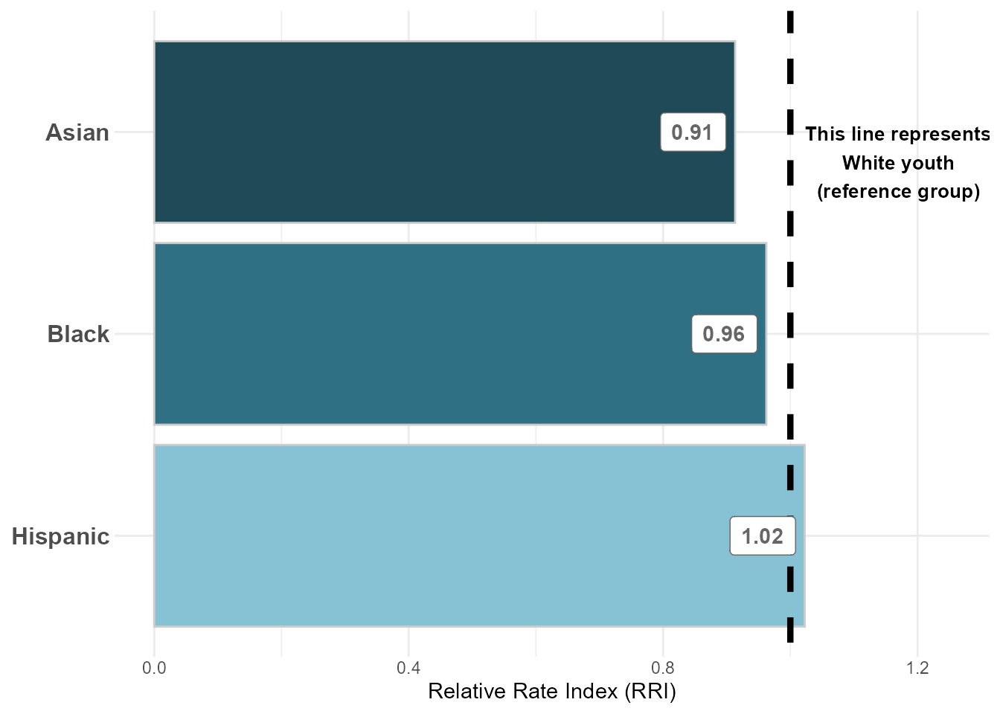{width=85%}
:::
:::


<br>

#### Figure 2: Predicted Probabilities of Petition by Referral Source


::: {.cell .column-page-right}
::: {.cell-output-display}
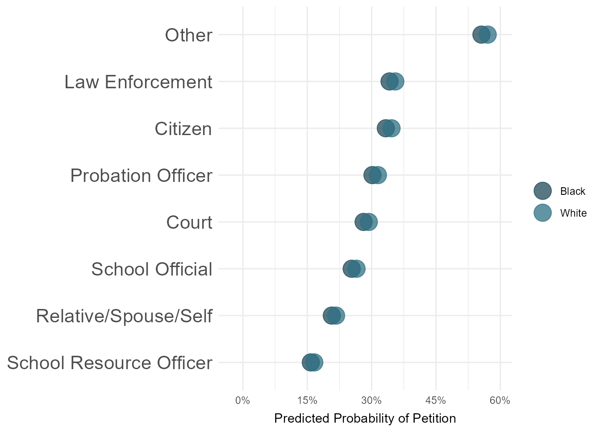{width=85%}
:::
:::


<br>

#### Figure 3: Predicted Probabilities of Petition by CSU 

**NOTE:** We will likely want to exclude CSU's with small N sizes -- I haven't yet done that. 


::: {.cell .column-page-right}
::: {.cell-output-display}
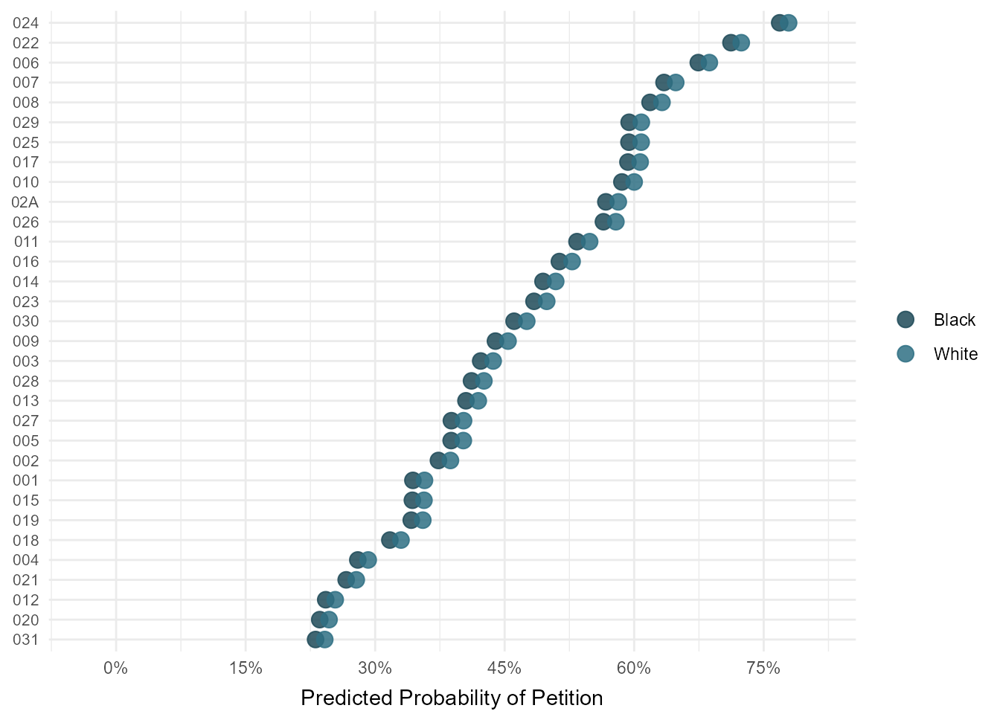{width=85%}
:::
:::


<br>

#### Figure 4: Predicted Probabilities of Petition by Charge Type 

**Question:** Do status offenses have relatively lower predicted probability of diversion b/c they are more likely to be dismissed? This could be a drawback of the current model (where all intake decisions are included and coded into either diversion or not diversion)


::: {.cell .column-page-right}
::: {.cell-output-display}
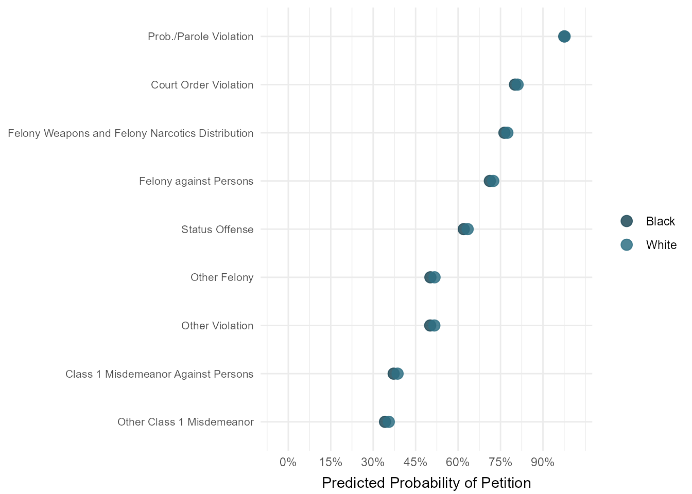{width=85%}
:::
:::


<br><br>

## 2. Adjusted: Diversion versus Resolved/Dismissed 

In the following analysis, the outcome variable is binary -- split into diverted (meaning complaint was diverted at intake) and resolved/dismissed (either "complaint unfounded" or "resolved"). All records with other intake complaint decisions are excluded.

**NOTE:** Predictors included in model are:

* race

* gender

* age at intake

* CSU

* referral/petitioner source

* category of offense

* year of petition

* JJ history

* counts of felony, misdemeanor, status, and violation charges associated with intake/complaint


Another control we could add is something on how rural/urban each county is...


::: {.cell .column-page-right}
::: {.cell-output-display}
`````{=html}
<table style="border-collapse:collapse; border:none;">
<tr>
<th style="border-top: double; text-align:center; font-style:normal; font-weight:bold; padding:0.2cm;  text-align:left; ">&nbsp;</th>
<th colspan="3" style="border-top: double; text-align:center; font-style:normal; font-weight:bold; padding:0.2cm; ">intake diverted flag num</th>
</tr>
<tr>
<td style=" text-align:center; border-bottom:1px solid; font-style:italic; font-weight:normal;  text-align:left; ">Predictors</td>
<td style=" text-align:center; border-bottom:1px solid; font-style:italic; font-weight:normal;  ">Odds Ratios</td>
<td style=" text-align:center; border-bottom:1px solid; font-style:italic; font-weight:normal;  ">CI</td>
<td style=" text-align:center; border-bottom:1px solid; font-style:italic; font-weight:normal;  ">p</td>
</tr>
<tr>
<td style=" padding:0.2cm; text-align:left; vertical-align:top; text-align:left; ">(Intercept)</td>
<td style=" padding:0.2cm; text-align:left; vertical-align:top; text-align:center;  ">0.37 <sup>***</sup></td>
<td style=" padding:0.2cm; text-align:left; vertical-align:top; text-align:center;  ">0.28&nbsp;&ndash;&nbsp;0.48</td>
<td style=" padding:0.2cm; text-align:left; vertical-align:top; text-align:center;  "><strong>&lt;0.001</strong></td>
</tr>
<tr>
<td style=" padding:0.2cm; text-align:left; vertical-align:top; text-align:left; ">race [American Indian]</td>
<td style=" padding:0.2cm; text-align:left; vertical-align:top; text-align:center;  ">1.21 <sup></sup></td>
<td style=" padding:0.2cm; text-align:left; vertical-align:top; text-align:center;  ">0.68&nbsp;&ndash;&nbsp;2.28</td>
<td style=" padding:0.2cm; text-align:left; vertical-align:top; text-align:center;  ">0.528</td>
</tr>
<tr>
<td style=" padding:0.2cm; text-align:left; vertical-align:top; text-align:left; ">race [Asian]</td>
<td style=" padding:0.2cm; text-align:left; vertical-align:top; text-align:center;  ">0.82 <sup>*</sup></td>
<td style=" padding:0.2cm; text-align:left; vertical-align:top; text-align:center;  ">0.69&nbsp;&ndash;&nbsp;0.99</td>
<td style=" padding:0.2cm; text-align:left; vertical-align:top; text-align:center;  "><strong>0.036</strong></td>
</tr>
<tr>
<td style=" padding:0.2cm; text-align:left; vertical-align:top; text-align:left; ">race [Black]</td>
<td style=" padding:0.2cm; text-align:left; vertical-align:top; text-align:center;  ">0.84 <sup>***</sup></td>
<td style=" padding:0.2cm; text-align:left; vertical-align:top; text-align:center;  ">0.79&nbsp;&ndash;&nbsp;0.88</td>
<td style=" padding:0.2cm; text-align:left; vertical-align:top; text-align:center;  "><strong>&lt;0.001</strong></td>
</tr>
<tr>
<td style=" padding:0.2cm; text-align:left; vertical-align:top; text-align:left; ">race [Hispanic]</td>
<td style=" padding:0.2cm; text-align:left; vertical-align:top; text-align:center;  ">0.95 <sup></sup></td>
<td style=" padding:0.2cm; text-align:left; vertical-align:top; text-align:center;  ">0.88&nbsp;&ndash;&nbsp;1.02</td>
<td style=" padding:0.2cm; text-align:left; vertical-align:top; text-align:center;  ">0.142</td>
</tr>
<tr>
<td style=" padding:0.2cm; text-align:left; vertical-align:top; text-align:left; ">race [Other]</td>
<td style=" padding:0.2cm; text-align:left; vertical-align:top; text-align:center;  ">0.79 <sup>***</sup></td>
<td style=" padding:0.2cm; text-align:left; vertical-align:top; text-align:center;  ">0.73&nbsp;&ndash;&nbsp;0.85</td>
<td style=" padding:0.2cm; text-align:left; vertical-align:top; text-align:center;  "><strong>&lt;0.001</strong></td>
</tr>
<tr>
<td style=" padding:0.2cm; text-align:left; vertical-align:top; text-align:left; ">gender [Female]</td>
<td style=" padding:0.2cm; text-align:left; vertical-align:top; text-align:center;  ">1.08 <sup>***</sup></td>
<td style=" padding:0.2cm; text-align:left; vertical-align:top; text-align:center;  ">1.04&nbsp;&ndash;&nbsp;1.13</td>
<td style=" padding:0.2cm; text-align:left; vertical-align:top; text-align:center;  "><strong>&lt;0.001</strong></td>
</tr>
<tr>
<td style=" padding:0.2cm; text-align:left; vertical-align:top; text-align:left; ">intake age</td>
<td style=" padding:0.2cm; text-align:left; vertical-align:top; text-align:center;  ">1.05 <sup>***</sup></td>
<td style=" padding:0.2cm; text-align:left; vertical-align:top; text-align:center;  ">1.04&nbsp;&ndash;&nbsp;1.06</td>
<td style=" padding:0.2cm; text-align:left; vertical-align:top; text-align:center;  "><strong>&lt;0.001</strong></td>
</tr>
<tr>
<td style=" padding:0.2cm; text-align:left; vertical-align:top; text-align:left; ">csu [002]</td>
<td style=" padding:0.2cm; text-align:left; vertical-align:top; text-align:center;  ">3.67 <sup>***</sup></td>
<td style=" padding:0.2cm; text-align:left; vertical-align:top; text-align:center;  ">3.13&nbsp;&ndash;&nbsp;4.31</td>
<td style=" padding:0.2cm; text-align:left; vertical-align:top; text-align:center;  "><strong>&lt;0.001</strong></td>
</tr>
<tr>
<td style=" padding:0.2cm; text-align:left; vertical-align:top; text-align:left; ">csu [003]</td>
<td style=" padding:0.2cm; text-align:left; vertical-align:top; text-align:center;  ">13.85 <sup>***</sup></td>
<td style=" padding:0.2cm; text-align:left; vertical-align:top; text-align:center;  ">10.85&nbsp;&ndash;&nbsp;17.79</td>
<td style=" padding:0.2cm; text-align:left; vertical-align:top; text-align:center;  "><strong>&lt;0.001</strong></td>
</tr>
<tr>
<td style=" padding:0.2cm; text-align:left; vertical-align:top; text-align:left; ">csu [004]</td>
<td style=" padding:0.2cm; text-align:left; vertical-align:top; text-align:center;  ">1.64 <sup>***</sup></td>
<td style=" padding:0.2cm; text-align:left; vertical-align:top; text-align:center;  ">1.40&nbsp;&ndash;&nbsp;1.91</td>
<td style=" padding:0.2cm; text-align:left; vertical-align:top; text-align:center;  "><strong>&lt;0.001</strong></td>
</tr>
<tr>
<td style=" padding:0.2cm; text-align:left; vertical-align:top; text-align:left; ">csu [005]</td>
<td style=" padding:0.2cm; text-align:left; vertical-align:top; text-align:center;  ">14.22 <sup>***</sup></td>
<td style=" padding:0.2cm; text-align:left; vertical-align:top; text-align:center;  ">11.14&nbsp;&ndash;&nbsp;18.32</td>
<td style=" padding:0.2cm; text-align:left; vertical-align:top; text-align:center;  "><strong>&lt;0.001</strong></td>
</tr>
<tr>
<td style=" padding:0.2cm; text-align:left; vertical-align:top; text-align:left; ">csu [006]</td>
<td style=" padding:0.2cm; text-align:left; vertical-align:top; text-align:center;  ">0.85 <sup></sup></td>
<td style=" padding:0.2cm; text-align:left; vertical-align:top; text-align:center;  ">0.68&nbsp;&ndash;&nbsp;1.07</td>
<td style=" padding:0.2cm; text-align:left; vertical-align:top; text-align:center;  ">0.167</td>
</tr>
<tr>
<td style=" padding:0.2cm; text-align:left; vertical-align:top; text-align:left; ">csu [007]</td>
<td style=" padding:0.2cm; text-align:left; vertical-align:top; text-align:center;  ">1.70 <sup>***</sup></td>
<td style=" padding:0.2cm; text-align:left; vertical-align:top; text-align:center;  ">1.39&nbsp;&ndash;&nbsp;2.08</td>
<td style=" padding:0.2cm; text-align:left; vertical-align:top; text-align:center;  "><strong>&lt;0.001</strong></td>
</tr>
<tr>
<td style=" padding:0.2cm; text-align:left; vertical-align:top; text-align:left; ">csu [008]</td>
<td style=" padding:0.2cm; text-align:left; vertical-align:top; text-align:center;  ">2.38 <sup>***</sup></td>
<td style=" padding:0.2cm; text-align:left; vertical-align:top; text-align:center;  ">1.93&nbsp;&ndash;&nbsp;2.93</td>
<td style=" padding:0.2cm; text-align:left; vertical-align:top; text-align:center;  "><strong>&lt;0.001</strong></td>
</tr>
<tr>
<td style=" padding:0.2cm; text-align:left; vertical-align:top; text-align:left; ">csu [009]</td>
<td style=" padding:0.2cm; text-align:left; vertical-align:top; text-align:center;  ">5.73 <sup>***</sup></td>
<td style=" padding:0.2cm; text-align:left; vertical-align:top; text-align:center;  ">4.82&nbsp;&ndash;&nbsp;6.83</td>
<td style=" padding:0.2cm; text-align:left; vertical-align:top; text-align:center;  "><strong>&lt;0.001</strong></td>
</tr>
<tr>
<td style=" padding:0.2cm; text-align:left; vertical-align:top; text-align:left; ">csu [010]</td>
<td style=" padding:0.2cm; text-align:left; vertical-align:top; text-align:center;  ">14.44 <sup>***</sup></td>
<td style=" padding:0.2cm; text-align:left; vertical-align:top; text-align:center;  ">11.39&nbsp;&ndash;&nbsp;18.45</td>
<td style=" padding:0.2cm; text-align:left; vertical-align:top; text-align:center;  "><strong>&lt;0.001</strong></td>
</tr>
<tr>
<td style=" padding:0.2cm; text-align:left; vertical-align:top; text-align:left; ">csu [011]</td>
<td style=" padding:0.2cm; text-align:left; vertical-align:top; text-align:center;  ">2.90 <sup>***</sup></td>
<td style=" padding:0.2cm; text-align:left; vertical-align:top; text-align:center;  ">2.37&nbsp;&ndash;&nbsp;3.56</td>
<td style=" padding:0.2cm; text-align:left; vertical-align:top; text-align:center;  "><strong>&lt;0.001</strong></td>
</tr>
<tr>
<td style=" padding:0.2cm; text-align:left; vertical-align:top; text-align:left; ">csu [012]</td>
<td style=" padding:0.2cm; text-align:left; vertical-align:top; text-align:center;  ">5.35 <sup>***</sup></td>
<td style=" padding:0.2cm; text-align:left; vertical-align:top; text-align:center;  ">4.62&nbsp;&ndash;&nbsp;6.20</td>
<td style=" padding:0.2cm; text-align:left; vertical-align:top; text-align:center;  "><strong>&lt;0.001</strong></td>
</tr>
<tr>
<td style=" padding:0.2cm; text-align:left; vertical-align:top; text-align:left; ">csu [013]</td>
<td style=" padding:0.2cm; text-align:left; vertical-align:top; text-align:center;  ">8.40 <sup>***</sup></td>
<td style=" padding:0.2cm; text-align:left; vertical-align:top; text-align:center;  ">6.95&nbsp;&ndash;&nbsp;10.19</td>
<td style=" padding:0.2cm; text-align:left; vertical-align:top; text-align:center;  "><strong>&lt;0.001</strong></td>
</tr>
<tr>
<td style=" padding:0.2cm; text-align:left; vertical-align:top; text-align:left; ">csu [014]</td>
<td style=" padding:0.2cm; text-align:left; vertical-align:top; text-align:center;  ">2.99 <sup>***</sup></td>
<td style=" padding:0.2cm; text-align:left; vertical-align:top; text-align:center;  ">2.56&nbsp;&ndash;&nbsp;3.50</td>
<td style=" padding:0.2cm; text-align:left; vertical-align:top; text-align:center;  "><strong>&lt;0.001</strong></td>
</tr>
<tr>
<td style=" padding:0.2cm; text-align:left; vertical-align:top; text-align:left; ">csu [015]</td>
<td style=" padding:0.2cm; text-align:left; vertical-align:top; text-align:center;  ">2.44 <sup>***</sup></td>
<td style=" padding:0.2cm; text-align:left; vertical-align:top; text-align:center;  ">2.12&nbsp;&ndash;&nbsp;2.82</td>
<td style=" padding:0.2cm; text-align:left; vertical-align:top; text-align:center;  "><strong>&lt;0.001</strong></td>
</tr>
<tr>
<td style=" padding:0.2cm; text-align:left; vertical-align:top; text-align:left; ">csu [016]</td>
<td style=" padding:0.2cm; text-align:left; vertical-align:top; text-align:center;  ">6.56 <sup>***</sup></td>
<td style=" padding:0.2cm; text-align:left; vertical-align:top; text-align:center;  ">5.55&nbsp;&ndash;&nbsp;7.77</td>
<td style=" padding:0.2cm; text-align:left; vertical-align:top; text-align:center;  "><strong>&lt;0.001</strong></td>
</tr>
<tr>
<td style=" padding:0.2cm; text-align:left; vertical-align:top; text-align:left; ">csu [017]</td>
<td style=" padding:0.2cm; text-align:left; vertical-align:top; text-align:center;  ">12.20 <sup>***</sup></td>
<td style=" padding:0.2cm; text-align:left; vertical-align:top; text-align:center;  ">9.49&nbsp;&ndash;&nbsp;15.78</td>
<td style=" padding:0.2cm; text-align:left; vertical-align:top; text-align:center;  "><strong>&lt;0.001</strong></td>
</tr>
<tr>
<td style=" padding:0.2cm; text-align:left; vertical-align:top; text-align:left; ">csu [018]</td>
<td style=" padding:0.2cm; text-align:left; vertical-align:top; text-align:center;  ">1.47 <sup>***</sup></td>
<td style=" padding:0.2cm; text-align:left; vertical-align:top; text-align:center;  ">1.20&nbsp;&ndash;&nbsp;1.80</td>
<td style=" padding:0.2cm; text-align:left; vertical-align:top; text-align:center;  "><strong>&lt;0.001</strong></td>
</tr>
<tr>
<td style=" padding:0.2cm; text-align:left; vertical-align:top; text-align:left; ">csu [019]</td>
<td style=" padding:0.2cm; text-align:left; vertical-align:top; text-align:center;  ">2.99 <sup>***</sup></td>
<td style=" padding:0.2cm; text-align:left; vertical-align:top; text-align:center;  ">2.56&nbsp;&ndash;&nbsp;3.49</td>
<td style=" padding:0.2cm; text-align:left; vertical-align:top; text-align:center;  "><strong>&lt;0.001</strong></td>
</tr>
<tr>
<td style=" padding:0.2cm; text-align:left; vertical-align:top; text-align:left; ">csu [020]</td>
<td style=" padding:0.2cm; text-align:left; vertical-align:top; text-align:center;  ">4.19 <sup>***</sup></td>
<td style=" padding:0.2cm; text-align:left; vertical-align:top; text-align:center;  ">3.59&nbsp;&ndash;&nbsp;4.90</td>
<td style=" padding:0.2cm; text-align:left; vertical-align:top; text-align:center;  "><strong>&lt;0.001</strong></td>
</tr>
<tr>
<td style=" padding:0.2cm; text-align:left; vertical-align:top; text-align:left; ">csu [021]</td>
<td style=" padding:0.2cm; text-align:left; vertical-align:top; text-align:center;  ">3.70 <sup>***</sup></td>
<td style=" padding:0.2cm; text-align:left; vertical-align:top; text-align:center;  ">3.08&nbsp;&ndash;&nbsp;4.46</td>
<td style=" padding:0.2cm; text-align:left; vertical-align:top; text-align:center;  "><strong>&lt;0.001</strong></td>
</tr>
<tr>
<td style=" padding:0.2cm; text-align:left; vertical-align:top; text-align:left; ">csu [022]</td>
<td style=" padding:0.2cm; text-align:left; vertical-align:top; text-align:center;  ">15.20 <sup>***</sup></td>
<td style=" padding:0.2cm; text-align:left; vertical-align:top; text-align:center;  ">12.14&nbsp;&ndash;&nbsp;19.13</td>
<td style=" padding:0.2cm; text-align:left; vertical-align:top; text-align:center;  "><strong>&lt;0.001</strong></td>
</tr>
<tr>
<td style=" padding:0.2cm; text-align:left; vertical-align:top; text-align:left; ">csu [023]</td>
<td style=" padding:0.2cm; text-align:left; vertical-align:top; text-align:center;  ">5.22 <sup>***</sup></td>
<td style=" padding:0.2cm; text-align:left; vertical-align:top; text-align:center;  ">4.47&nbsp;&ndash;&nbsp;6.11</td>
<td style=" padding:0.2cm; text-align:left; vertical-align:top; text-align:center;  "><strong>&lt;0.001</strong></td>
</tr>
<tr>
<td style=" padding:0.2cm; text-align:left; vertical-align:top; text-align:left; ">csu [024]</td>
<td style=" padding:0.2cm; text-align:left; vertical-align:top; text-align:center;  ">24.83 <sup>***</sup></td>
<td style=" padding:0.2cm; text-align:left; vertical-align:top; text-align:center;  ">19.04&nbsp;&ndash;&nbsp;32.74</td>
<td style=" padding:0.2cm; text-align:left; vertical-align:top; text-align:center;  "><strong>&lt;0.001</strong></td>
</tr>
<tr>
<td style=" padding:0.2cm; text-align:left; vertical-align:top; text-align:left; ">csu [025]</td>
<td style=" padding:0.2cm; text-align:left; vertical-align:top; text-align:center;  ">3.29 <sup>***</sup></td>
<td style=" padding:0.2cm; text-align:left; vertical-align:top; text-align:center;  ">2.76&nbsp;&ndash;&nbsp;3.91</td>
<td style=" padding:0.2cm; text-align:left; vertical-align:top; text-align:center;  "><strong>&lt;0.001</strong></td>
</tr>
<tr>
<td style=" padding:0.2cm; text-align:left; vertical-align:top; text-align:left; ">csu [026]</td>
<td style=" padding:0.2cm; text-align:left; vertical-align:top; text-align:center;  ">11.35 <sup>***</sup></td>
<td style=" padding:0.2cm; text-align:left; vertical-align:top; text-align:center;  ">9.41&nbsp;&ndash;&nbsp;13.74</td>
<td style=" padding:0.2cm; text-align:left; vertical-align:top; text-align:center;  "><strong>&lt;0.001</strong></td>
</tr>
<tr>
<td style=" padding:0.2cm; text-align:left; vertical-align:top; text-align:left; ">csu [027]</td>
<td style=" padding:0.2cm; text-align:left; vertical-align:top; text-align:center;  ">23.42 <sup>***</sup></td>
<td style=" padding:0.2cm; text-align:left; vertical-align:top; text-align:center;  ">19.19&nbsp;&ndash;&nbsp;28.70</td>
<td style=" padding:0.2cm; text-align:left; vertical-align:top; text-align:center;  "><strong>&lt;0.001</strong></td>
</tr>
<tr>
<td style=" padding:0.2cm; text-align:left; vertical-align:top; text-align:left; ">csu [028]</td>
<td style=" padding:0.2cm; text-align:left; vertical-align:top; text-align:center;  ">12.40 <sup>***</sup></td>
<td style=" padding:0.2cm; text-align:left; vertical-align:top; text-align:center;  ">9.80&nbsp;&ndash;&nbsp;15.77</td>
<td style=" padding:0.2cm; text-align:left; vertical-align:top; text-align:center;  "><strong>&lt;0.001</strong></td>
</tr>
<tr>
<td style=" padding:0.2cm; text-align:left; vertical-align:top; text-align:left; ">csu [029]</td>
<td style=" padding:0.2cm; text-align:left; vertical-align:top; text-align:center;  ">11.03 <sup>***</sup></td>
<td style=" padding:0.2cm; text-align:left; vertical-align:top; text-align:center;  ">8.85&nbsp;&ndash;&nbsp;13.82</td>
<td style=" padding:0.2cm; text-align:left; vertical-align:top; text-align:center;  "><strong>&lt;0.001</strong></td>
</tr>
<tr>
<td style=" padding:0.2cm; text-align:left; vertical-align:top; text-align:left; ">csu [02A]</td>
<td style=" padding:0.2cm; text-align:left; vertical-align:top; text-align:center;  ">5.27 <sup>***</sup></td>
<td style=" padding:0.2cm; text-align:left; vertical-align:top; text-align:center;  ">3.96&nbsp;&ndash;&nbsp;7.07</td>
<td style=" padding:0.2cm; text-align:left; vertical-align:top; text-align:center;  "><strong>&lt;0.001</strong></td>
</tr>
<tr>
<td style=" padding:0.2cm; text-align:left; vertical-align:top; text-align:left; ">csu [030]</td>
<td style=" padding:0.2cm; text-align:left; vertical-align:top; text-align:center;  ">5.52 <sup>***</sup></td>
<td style=" padding:0.2cm; text-align:left; vertical-align:top; text-align:center;  ">4.59&nbsp;&ndash;&nbsp;6.65</td>
<td style=" padding:0.2cm; text-align:left; vertical-align:top; text-align:center;  "><strong>&lt;0.001</strong></td>
</tr>
<tr>
<td style=" padding:0.2cm; text-align:left; vertical-align:top; text-align:left; ">csu [031]</td>
<td style=" padding:0.2cm; text-align:left; vertical-align:top; text-align:center;  ">3.59 <sup>***</sup></td>
<td style=" padding:0.2cm; text-align:left; vertical-align:top; text-align:center;  ">3.13&nbsp;&ndash;&nbsp;4.13</td>
<td style=" padding:0.2cm; text-align:left; vertical-align:top; text-align:center;  "><strong>&lt;0.001</strong></td>
</tr>
<tr>
<td style=" padding:0.2cm; text-align:left; vertical-align:top; text-align:left; ">referral source clean<br>[Citizen]</td>
<td style=" padding:0.2cm; text-align:left; vertical-align:top; text-align:center;  ">0.42 <sup>***</sup></td>
<td style=" padding:0.2cm; text-align:left; vertical-align:top; text-align:center;  ">0.35&nbsp;&ndash;&nbsp;0.50</td>
<td style=" padding:0.2cm; text-align:left; vertical-align:top; text-align:center;  "><strong>&lt;0.001</strong></td>
</tr>
<tr>
<td style=" padding:0.2cm; text-align:left; vertical-align:top; text-align:left; ">referral source clean<br>[Court]</td>
<td style=" padding:0.2cm; text-align:left; vertical-align:top; text-align:center;  ">1.03 <sup></sup></td>
<td style=" padding:0.2cm; text-align:left; vertical-align:top; text-align:center;  ">0.59&nbsp;&ndash;&nbsp;1.84</td>
<td style=" padding:0.2cm; text-align:left; vertical-align:top; text-align:center;  ">0.924</td>
</tr>
<tr>
<td style=" padding:0.2cm; text-align:left; vertical-align:top; text-align:left; ">referral source clean<br>[Law Enforcement]</td>
<td style=" padding:0.2cm; text-align:left; vertical-align:top; text-align:center;  ">0.72 <sup>***</sup></td>
<td style=" padding:0.2cm; text-align:left; vertical-align:top; text-align:center;  ">0.63&nbsp;&ndash;&nbsp;0.83</td>
<td style=" padding:0.2cm; text-align:left; vertical-align:top; text-align:center;  "><strong>&lt;0.001</strong></td>
</tr>
<tr>
<td style=" padding:0.2cm; text-align:left; vertical-align:top; text-align:left; ">referral source clean<br>[Probation Officer]</td>
<td style=" padding:0.2cm; text-align:left; vertical-align:top; text-align:center;  ">0.57 <sup>***</sup></td>
<td style=" padding:0.2cm; text-align:left; vertical-align:top; text-align:center;  ">0.43&nbsp;&ndash;&nbsp;0.75</td>
<td style=" padding:0.2cm; text-align:left; vertical-align:top; text-align:center;  "><strong>&lt;0.001</strong></td>
</tr>
<tr>
<td style=" padding:0.2cm; text-align:left; vertical-align:top; text-align:left; ">referral source clean<br>[Relative/Spouse/Self]</td>
<td style=" padding:0.2cm; text-align:left; vertical-align:top; text-align:center;  ">0.30 <sup>***</sup></td>
<td style=" padding:0.2cm; text-align:left; vertical-align:top; text-align:center;  ">0.25&nbsp;&ndash;&nbsp;0.35</td>
<td style=" padding:0.2cm; text-align:left; vertical-align:top; text-align:center;  "><strong>&lt;0.001</strong></td>
</tr>
<tr>
<td style=" padding:0.2cm; text-align:left; vertical-align:top; text-align:left; ">referral source clean<br>[School Official]</td>
<td style=" padding:0.2cm; text-align:left; vertical-align:top; text-align:center;  ">0.87 <sup></sup></td>
<td style=" padding:0.2cm; text-align:left; vertical-align:top; text-align:center;  ">0.74&nbsp;&ndash;&nbsp;1.03</td>
<td style=" padding:0.2cm; text-align:left; vertical-align:top; text-align:center;  ">0.100</td>
</tr>
<tr>
<td style=" padding:0.2cm; text-align:left; vertical-align:top; text-align:left; ">referral source clean<br>[School Resource Officer]</td>
<td style=" padding:0.2cm; text-align:left; vertical-align:top; text-align:center;  ">0.73 <sup>***</sup></td>
<td style=" padding:0.2cm; text-align:left; vertical-align:top; text-align:center;  ">0.62&nbsp;&ndash;&nbsp;0.85</td>
<td style=" padding:0.2cm; text-align:left; vertical-align:top; text-align:center;  "><strong>&lt;0.001</strong></td>
</tr>
<tr>
<td style=" padding:0.2cm; text-align:left; vertical-align:top; text-align:left; ">dai [Court Order<br>Violation]</td>
<td style=" padding:0.2cm; text-align:left; vertical-align:top; text-align:center;  ">0.03 <sup>***</sup></td>
<td style=" padding:0.2cm; text-align:left; vertical-align:top; text-align:center;  ">0.01&nbsp;&ndash;&nbsp;0.06</td>
<td style=" padding:0.2cm; text-align:left; vertical-align:top; text-align:center;  "><strong>&lt;0.001</strong></td>
</tr>
<tr>
<td style=" padding:0.2cm; text-align:left; vertical-align:top; text-align:left; ">dai [Felony against<br>Persons]</td>
<td style=" padding:0.2cm; text-align:left; vertical-align:top; text-align:center;  ">1.08 <sup></sup></td>
<td style=" padding:0.2cm; text-align:left; vertical-align:top; text-align:center;  ">0.87&nbsp;&ndash;&nbsp;1.34</td>
<td style=" padding:0.2cm; text-align:left; vertical-align:top; text-align:center;  ">0.465</td>
</tr>
<tr>
<td style=" padding:0.2cm; text-align:left; vertical-align:top; text-align:left; ">dai [Felony Weapons and<br>Felony Narcotics<br>Distribution]</td>
<td style=" padding:0.2cm; text-align:left; vertical-align:top; text-align:center;  ">1.19 <sup></sup></td>
<td style=" padding:0.2cm; text-align:left; vertical-align:top; text-align:center;  ">0.77&nbsp;&ndash;&nbsp;1.89</td>
<td style=" padding:0.2cm; text-align:left; vertical-align:top; text-align:center;  ">0.439</td>
</tr>
<tr>
<td style=" padding:0.2cm; text-align:left; vertical-align:top; text-align:left; ">dai [Other Class 1<br>Misdemeanor]</td>
<td style=" padding:0.2cm; text-align:left; vertical-align:top; text-align:center;  ">1.70 <sup>***</sup></td>
<td style=" padding:0.2cm; text-align:left; vertical-align:top; text-align:center;  ">1.61&nbsp;&ndash;&nbsp;1.81</td>
<td style=" padding:0.2cm; text-align:left; vertical-align:top; text-align:center;  "><strong>&lt;0.001</strong></td>
</tr>
<tr>
<td style=" padding:0.2cm; text-align:left; vertical-align:top; text-align:left; ">dai [Other Felony]</td>
<td style=" padding:0.2cm; text-align:left; vertical-align:top; text-align:center;  ">1.80 <sup>***</sup></td>
<td style=" padding:0.2cm; text-align:left; vertical-align:top; text-align:center;  ">1.47&nbsp;&ndash;&nbsp;2.19</td>
<td style=" padding:0.2cm; text-align:left; vertical-align:top; text-align:center;  "><strong>&lt;0.001</strong></td>
</tr>
<tr>
<td style=" padding:0.2cm; text-align:left; vertical-align:top; text-align:left; ">dai [Other Violation]</td>
<td style=" padding:0.2cm; text-align:left; vertical-align:top; text-align:center;  ">2.64 <sup>***</sup></td>
<td style=" padding:0.2cm; text-align:left; vertical-align:top; text-align:center;  ">2.24&nbsp;&ndash;&nbsp;3.11</td>
<td style=" padding:0.2cm; text-align:left; vertical-align:top; text-align:center;  "><strong>&lt;0.001</strong></td>
</tr>
<tr>
<td style=" padding:0.2cm; text-align:left; vertical-align:top; text-align:left; ">dai [Prob./Parole<br>Violation]</td>
<td style=" padding:0.2cm; text-align:left; vertical-align:top; text-align:center;  ">0.00 <sup></sup></td>
<td style=" padding:0.2cm; text-align:left; vertical-align:top; text-align:center;  ">0.00&nbsp;&ndash;&nbsp;0.00</td>
<td style=" padding:0.2cm; text-align:left; vertical-align:top; text-align:center;  ">0.863</td>
</tr>
<tr>
<td style=" padding:0.2cm; text-align:left; vertical-align:top; text-align:left; ">dai [Status Offense]</td>
<td style=" padding:0.2cm; text-align:left; vertical-align:top; text-align:center;  ">0.69 <sup>***</sup></td>
<td style=" padding:0.2cm; text-align:left; vertical-align:top; text-align:center;  ">0.58&nbsp;&ndash;&nbsp;0.83</td>
<td style=" padding:0.2cm; text-align:left; vertical-align:top; text-align:center;  "><strong>&lt;0.001</strong></td>
</tr>
<tr>
<td style=" padding:0.2cm; text-align:left; vertical-align:top; text-align:left; ">date opened year [2016]</td>
<td style=" padding:0.2cm; text-align:left; vertical-align:top; text-align:center;  ">1.09 <sup></sup></td>
<td style=" padding:0.2cm; text-align:left; vertical-align:top; text-align:center;  ">0.99&nbsp;&ndash;&nbsp;1.19</td>
<td style=" padding:0.2cm; text-align:left; vertical-align:top; text-align:center;  ">0.064</td>
</tr>
<tr>
<td style=" padding:0.2cm; text-align:left; vertical-align:top; text-align:left; ">date opened year [2017]</td>
<td style=" padding:0.2cm; text-align:left; vertical-align:top; text-align:center;  ">1.03 <sup></sup></td>
<td style=" padding:0.2cm; text-align:left; vertical-align:top; text-align:center;  ">0.94&nbsp;&ndash;&nbsp;1.12</td>
<td style=" padding:0.2cm; text-align:left; vertical-align:top; text-align:center;  ">0.553</td>
</tr>
<tr>
<td style=" padding:0.2cm; text-align:left; vertical-align:top; text-align:left; ">date opened year [2018]</td>
<td style=" padding:0.2cm; text-align:left; vertical-align:top; text-align:center;  ">1.13 <sup>**</sup></td>
<td style=" padding:0.2cm; text-align:left; vertical-align:top; text-align:center;  ">1.03&nbsp;&ndash;&nbsp;1.24</td>
<td style=" padding:0.2cm; text-align:left; vertical-align:top; text-align:center;  "><strong>0.008</strong></td>
</tr>
<tr>
<td style=" padding:0.2cm; text-align:left; vertical-align:top; text-align:left; ">date opened year [2019]</td>
<td style=" padding:0.2cm; text-align:left; vertical-align:top; text-align:center;  ">1.17 <sup>***</sup></td>
<td style=" padding:0.2cm; text-align:left; vertical-align:top; text-align:center;  ">1.07&nbsp;&ndash;&nbsp;1.28</td>
<td style=" padding:0.2cm; text-align:left; vertical-align:top; text-align:center;  "><strong>&lt;0.001</strong></td>
</tr>
<tr>
<td style=" padding:0.2cm; text-align:left; vertical-align:top; text-align:left; ">date opened year [2020]</td>
<td style=" padding:0.2cm; text-align:left; vertical-align:top; text-align:center;  ">0.81 <sup>***</sup></td>
<td style=" padding:0.2cm; text-align:left; vertical-align:top; text-align:center;  ">0.73&nbsp;&ndash;&nbsp;0.89</td>
<td style=" padding:0.2cm; text-align:left; vertical-align:top; text-align:center;  "><strong>&lt;0.001</strong></td>
</tr>
<tr>
<td style=" padding:0.2cm; text-align:left; vertical-align:top; text-align:left; ">date opened year [2021]</td>
<td style=" padding:0.2cm; text-align:left; vertical-align:top; text-align:center;  ">1.12 <sup></sup></td>
<td style=" padding:0.2cm; text-align:left; vertical-align:top; text-align:center;  ">0.99&nbsp;&ndash;&nbsp;1.26</td>
<td style=" padding:0.2cm; text-align:left; vertical-align:top; text-align:center;  ">0.068</td>
</tr>
<tr>
<td style=" padding:0.2cm; text-align:left; vertical-align:top; text-align:left; ">jj history clean [Prior<br>'Other' History]</td>
<td style=" padding:0.2cm; text-align:left; vertical-align:top; text-align:center;  ">0.32 <sup>***</sup></td>
<td style=" padding:0.2cm; text-align:left; vertical-align:top; text-align:center;  ">0.29&nbsp;&ndash;&nbsp;0.35</td>
<td style=" padding:0.2cm; text-align:left; vertical-align:top; text-align:center;  "><strong>&lt;0.001</strong></td>
</tr>
<tr>
<td style=" padding:0.2cm; text-align:left; vertical-align:top; text-align:left; ">jj history clean [Prior<br>Status/CHINS/CHINsup]</td>
<td style=" padding:0.2cm; text-align:left; vertical-align:top; text-align:center;  ">0.80 <sup>***</sup></td>
<td style=" padding:0.2cm; text-align:left; vertical-align:top; text-align:center;  ">0.74&nbsp;&ndash;&nbsp;0.85</td>
<td style=" padding:0.2cm; text-align:left; vertical-align:top; text-align:center;  "><strong>&lt;0.001</strong></td>
</tr>
<tr>
<td style=" padding:0.2cm; text-align:left; vertical-align:top; text-align:left; ">jj history clean [Prior<br>Misdemeanor]</td>
<td style=" padding:0.2cm; text-align:left; vertical-align:top; text-align:center;  ">0.69 <sup>***</sup></td>
<td style=" padding:0.2cm; text-align:left; vertical-align:top; text-align:center;  ">0.65&nbsp;&ndash;&nbsp;0.73</td>
<td style=" padding:0.2cm; text-align:left; vertical-align:top; text-align:center;  "><strong>&lt;0.001</strong></td>
</tr>
<tr>
<td style=" padding:0.2cm; text-align:left; vertical-align:top; text-align:left; ">jj history clean [Prior<br>Felony]</td>
<td style=" padding:0.2cm; text-align:left; vertical-align:top; text-align:center;  ">0.67 <sup>***</sup></td>
<td style=" padding:0.2cm; text-align:left; vertical-align:top; text-align:center;  ">0.56&nbsp;&ndash;&nbsp;0.80</td>
<td style=" padding:0.2cm; text-align:left; vertical-align:top; text-align:center;  "><strong>&lt;0.001</strong></td>
</tr>
<tr>
<td style=" padding:0.2cm; text-align:left; vertical-align:top; text-align:left; ">count misd with case</td>
<td style=" padding:0.2cm; text-align:left; vertical-align:top; text-align:center;  ">1.09 <sup>**</sup></td>
<td style=" padding:0.2cm; text-align:left; vertical-align:top; text-align:center;  ">1.04&nbsp;&ndash;&nbsp;1.15</td>
<td style=" padding:0.2cm; text-align:left; vertical-align:top; text-align:center;  "><strong>0.001</strong></td>
</tr>
<tr>
<td style=" padding:0.2cm; text-align:left; vertical-align:top; text-align:left; ">count felony with case</td>
<td style=" padding:0.2cm; text-align:left; vertical-align:top; text-align:center;  ">0.97 <sup></sup></td>
<td style=" padding:0.2cm; text-align:left; vertical-align:top; text-align:center;  ">0.85&nbsp;&ndash;&nbsp;1.10</td>
<td style=" padding:0.2cm; text-align:left; vertical-align:top; text-align:center;  ">0.610</td>
</tr>
<tr>
<td style=" padding:0.2cm; text-align:left; vertical-align:top; text-align:left; ">count status with case</td>
<td style=" padding:0.2cm; text-align:left; vertical-align:top; text-align:center;  ">0.89 <sup></sup></td>
<td style=" padding:0.2cm; text-align:left; vertical-align:top; text-align:center;  ">0.78&nbsp;&ndash;&nbsp;1.03</td>
<td style=" padding:0.2cm; text-align:left; vertical-align:top; text-align:center;  ">0.118</td>
</tr>
<tr>
<td style=" padding:0.2cm; text-align:left; vertical-align:top; text-align:left; ">count violation with case</td>
<td style=" padding:0.2cm; text-align:left; vertical-align:top; text-align:center;  ">1.30 <sup>***</sup></td>
<td style=" padding:0.2cm; text-align:left; vertical-align:top; text-align:center;  ">1.15&nbsp;&ndash;&nbsp;1.47</td>
<td style=" padding:0.2cm; text-align:left; vertical-align:top; text-align:center;  "><strong>&lt;0.001</strong></td>
</tr>
<tr>
<td style=" padding:0.2cm; text-align:left; vertical-align:top; text-align:left; padding-top:0.1cm; padding-bottom:0.1cm; border-top:1px solid;">Observations</td>
<td style=" padding:0.2cm; text-align:left; vertical-align:top; padding-top:0.1cm; padding-bottom:0.1cm; text-align:left; border-top:1px solid;" colspan="3">52894</td>
</tr>
<tr>
<td style=" padding:0.2cm; text-align:left; vertical-align:top; text-align:left; padding-top:0.1cm; padding-bottom:0.1cm;">R<sup>2</sup> Tjur</td>
<td style=" padding:0.2cm; text-align:left; vertical-align:top; padding-top:0.1cm; padding-bottom:0.1cm; text-align:left;" colspan="3">0.188</td>
</tr>
<tr>
<td colspan="4" style="font-style:italic; border-top:double black; text-align:right;">* p&lt;0.05&nbsp;&nbsp;&nbsp;** p&lt;0.01&nbsp;&nbsp;&nbsp;*** p&lt;0.001</td>
</tr>

</table>

`````
:::
:::


<br>

#### Table 9: Predicted Probablities and Adjusted RRIs, Diverted (compared to Dismissed/Resolved)

**TO DO:** Double check predicted probability interpretation with categorical variables in model


::: {.cell .column-page-right}
::: {.cell-output-display}
`````{=html}
<table class="table table-striped table-hover table-condensed table-responsive" style="margin-left: auto; margin-right: auto;">
 <thead>
  <tr>
   <th style="text-align:center;"> race_eth </th>
   <th style="text-align:center;"> predicted_probability </th>
   <th style="text-align:center;"> std_error </th>
   <th style="text-align:center;"> rri </th>
  </tr>
 </thead>
<tbody>
  <tr>
   <td style="text-align:center;"> White </td>
   <td style="text-align:center;"> 0.8046558 </td>
   <td style="text-align:center;"> 0.0081516 </td>
   <td style="text-align:center;"> 1.0000000 </td>
  </tr>
  <tr>
   <td style="text-align:center;"> Black </td>
   <td style="text-align:center;"> 0.7747841 </td>
   <td style="text-align:center;"> 0.0091468 </td>
   <td style="text-align:center;"> 0.9628764 </td>
  </tr>
  <tr>
   <td style="text-align:center;"> Other </td>
   <td style="text-align:center;"> 0.7640672 </td>
   <td style="text-align:center;"> 0.0108720 </td>
   <td style="text-align:center;"> 0.9495578 </td>
  </tr>
  <tr>
   <td style="text-align:center;"> Hispanic </td>
   <td style="text-align:center;"> 0.7957383 </td>
   <td style="text-align:center;"> 0.0089797 </td>
   <td style="text-align:center;"> 0.9889176 </td>
  </tr>
  <tr>
   <td style="text-align:center;"> American Indian </td>
   <td style="text-align:center;"> 0.8334515 </td>
   <td style="text-align:center;"> 0.0432414 </td>
   <td style="text-align:center;"> 1.0357863 </td>
  </tr>
  <tr>
   <td style="text-align:center;"> Asian </td>
   <td style="text-align:center;"> 0.7719880 </td>
   <td style="text-align:center;"> 0.0180489 </td>
   <td style="text-align:center;"> 0.9594015 </td>
  </tr>
</tbody>
</table>

`````
:::
:::


<br><br>

#### Figure 5: Adjusted RRI: Diverted (compared to Dismissed/Resolved)

**NOTE:** Difference is statistically significant for both Asian (<0.05) and Black youth (<0.001)


::: {.cell .column-page-right}
::: {.cell-output-display}
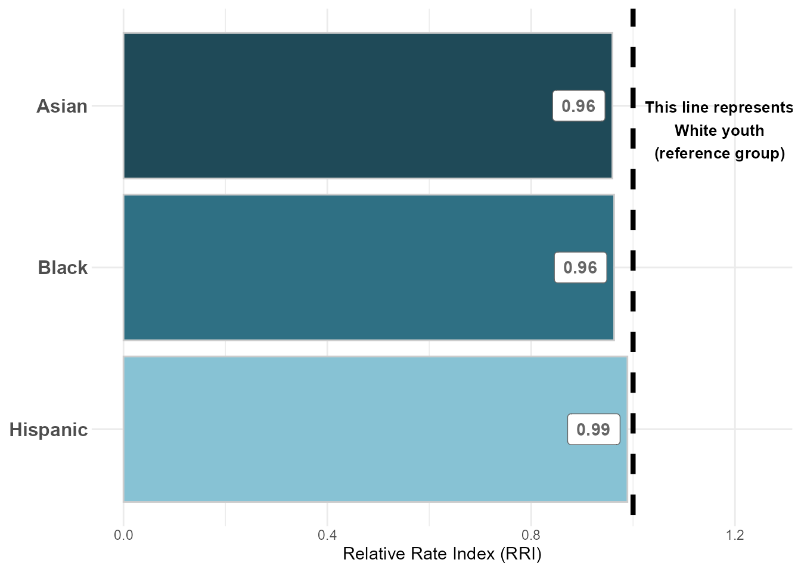{width=85%}
:::
:::


<br>

#### Figure 6: Predicted Probabilities of Diversion by Referral Source


::: {.cell .column-page-right}
::: {.cell-output-display}
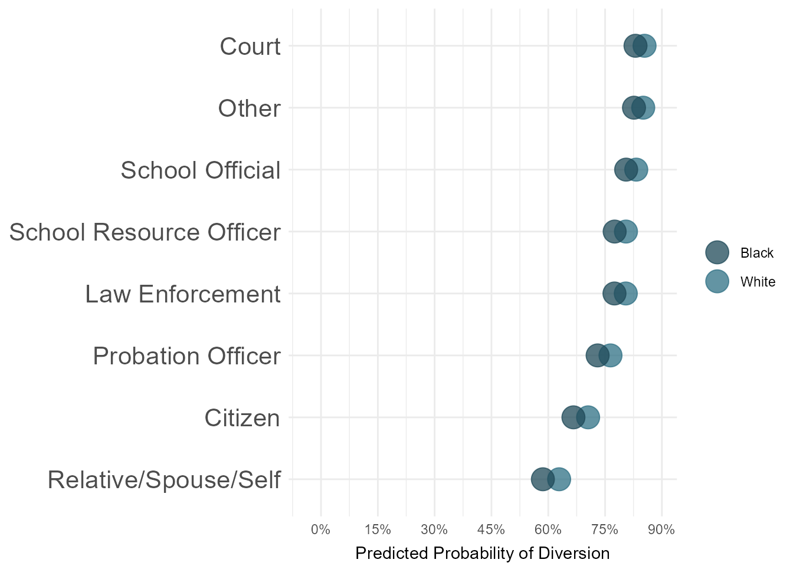{width=85%}
:::
:::


<br>

#### Figure 7: Predicted Probabilities of Diversion by CSU 

**NOTE:** We will likely want to exclude CSU's with small N sizes -- I haven't yet done that. 


::: {.cell .column-page-right}
::: {.cell-output-display}
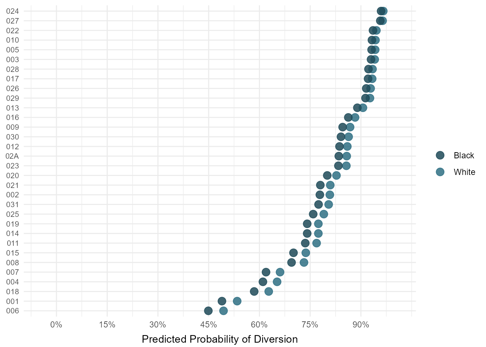{width=85%}
:::
:::


<br>

#### Figure 8: Predicted Probabilities of Diversion by Charge Type 

**Question:** Do status offenses have the lowest predicted probability of diversion b/c they are more likely to be dismissed? How should we treat this so as not to claim that VA diverts too few youth with status complaints -- if many are just being dismissed/resolved?


::: {.cell .column-page-right}
::: {.cell-output-display}
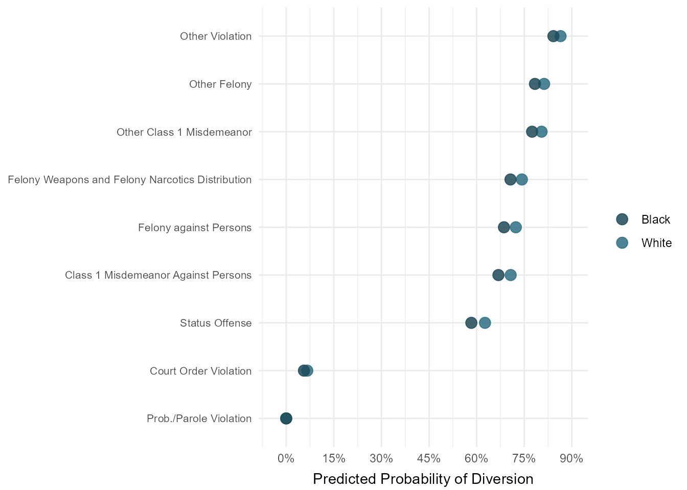{width=85%}
:::
:::


<br><br>

## 3. Adjusted: Diversion versus Petitioned

In the following analysis, the outcome variable is binary -- split into petitioned at intake (excluding court summons) and formally diverted (meaning complaint was diverted at intake). All records with other intake complaint decisions are excluded.


**NOTE:** Predictors included in model are:

* race

* gender

* age at intake

* CSU

* referral/petitioner source

* category of offense

* year of petition

* JJ history

* counts of felony, misdemeanor, status, and violation charges associated with intake/complaint


Another control we could add is something on how rural/urban each county is...


::: {.cell .column-page-right}
::: {.cell-output-display}
`````{=html}
<table style="border-collapse:collapse; border:none;">
<tr>
<th style="border-top: double; text-align:center; font-style:normal; font-weight:bold; padding:0.2cm;  text-align:left; ">&nbsp;</th>
<th colspan="3" style="border-top: double; text-align:center; font-style:normal; font-weight:bold; padding:0.2cm; ">intake diverted flag num</th>
</tr>
<tr>
<td style=" text-align:center; border-bottom:1px solid; font-style:italic; font-weight:normal;  text-align:left; ">Predictors</td>
<td style=" text-align:center; border-bottom:1px solid; font-style:italic; font-weight:normal;  ">Odds Ratios</td>
<td style=" text-align:center; border-bottom:1px solid; font-style:italic; font-weight:normal;  ">CI</td>
<td style=" text-align:center; border-bottom:1px solid; font-style:italic; font-weight:normal;  ">p</td>
</tr>
<tr>
<td style=" padding:0.2cm; text-align:left; vertical-align:top; text-align:left; ">(Intercept)</td>
<td style=" padding:0.2cm; text-align:left; vertical-align:top; text-align:center;  ">0.74 <sup>**</sup></td>
<td style=" padding:0.2cm; text-align:left; vertical-align:top; text-align:center;  ">0.62&nbsp;&ndash;&nbsp;0.89</td>
<td style=" padding:0.2cm; text-align:left; vertical-align:top; text-align:center;  "><strong>0.001</strong></td>
</tr>
<tr>
<td style=" padding:0.2cm; text-align:left; vertical-align:top; text-align:left; ">race [American Indian]</td>
<td style=" padding:0.2cm; text-align:left; vertical-align:top; text-align:center;  ">1.13 <sup></sup></td>
<td style=" padding:0.2cm; text-align:left; vertical-align:top; text-align:center;  ">0.75&nbsp;&ndash;&nbsp;1.69</td>
<td style=" padding:0.2cm; text-align:left; vertical-align:top; text-align:center;  ">0.558</td>
</tr>
<tr>
<td style=" padding:0.2cm; text-align:left; vertical-align:top; text-align:left; ">race [Asian]</td>
<td style=" padding:0.2cm; text-align:left; vertical-align:top; text-align:center;  ">1.08 <sup></sup></td>
<td style=" padding:0.2cm; text-align:left; vertical-align:top; text-align:center;  ">0.94&nbsp;&ndash;&nbsp;1.24</td>
<td style=" padding:0.2cm; text-align:left; vertical-align:top; text-align:center;  ">0.281</td>
</tr>
<tr>
<td style=" padding:0.2cm; text-align:left; vertical-align:top; text-align:left; ">race [Black]</td>
<td style=" padding:0.2cm; text-align:left; vertical-align:top; text-align:center;  ">0.99 <sup></sup></td>
<td style=" padding:0.2cm; text-align:left; vertical-align:top; text-align:center;  ">0.95&nbsp;&ndash;&nbsp;1.03</td>
<td style=" padding:0.2cm; text-align:left; vertical-align:top; text-align:center;  ">0.557</td>
</tr>
<tr>
<td style=" padding:0.2cm; text-align:left; vertical-align:top; text-align:left; ">race [Hispanic]</td>
<td style=" padding:0.2cm; text-align:left; vertical-align:top; text-align:center;  ">0.96 <sup></sup></td>
<td style=" padding:0.2cm; text-align:left; vertical-align:top; text-align:center;  ">0.91&nbsp;&ndash;&nbsp;1.02</td>
<td style=" padding:0.2cm; text-align:left; vertical-align:top; text-align:center;  ">0.179</td>
</tr>
<tr>
<td style=" padding:0.2cm; text-align:left; vertical-align:top; text-align:left; ">race [Other]</td>
<td style=" padding:0.2cm; text-align:left; vertical-align:top; text-align:center;  ">0.93 <sup>*</sup></td>
<td style=" padding:0.2cm; text-align:left; vertical-align:top; text-align:center;  ">0.88&nbsp;&ndash;&nbsp;0.99</td>
<td style=" padding:0.2cm; text-align:left; vertical-align:top; text-align:center;  "><strong>0.018</strong></td>
</tr>
<tr>
<td style=" padding:0.2cm; text-align:left; vertical-align:top; text-align:left; ">gender [Female]</td>
<td style=" padding:0.2cm; text-align:left; vertical-align:top; text-align:center;  ">1.15 <sup>***</sup></td>
<td style=" padding:0.2cm; text-align:left; vertical-align:top; text-align:center;  ">1.12&nbsp;&ndash;&nbsp;1.19</td>
<td style=" padding:0.2cm; text-align:left; vertical-align:top; text-align:center;  "><strong>&lt;0.001</strong></td>
</tr>
<tr>
<td style=" padding:0.2cm; text-align:left; vertical-align:top; text-align:left; ">intake age</td>
<td style=" padding:0.2cm; text-align:left; vertical-align:top; text-align:center;  ">0.93 <sup>***</sup></td>
<td style=" padding:0.2cm; text-align:left; vertical-align:top; text-align:center;  ">0.92&nbsp;&ndash;&nbsp;0.94</td>
<td style=" padding:0.2cm; text-align:left; vertical-align:top; text-align:center;  "><strong>&lt;0.001</strong></td>
</tr>
<tr>
<td style=" padding:0.2cm; text-align:left; vertical-align:top; text-align:left; ">csu [002]</td>
<td style=" padding:0.2cm; text-align:left; vertical-align:top; text-align:center;  ">2.64 <sup>***</sup></td>
<td style=" padding:0.2cm; text-align:left; vertical-align:top; text-align:center;  ">2.31&nbsp;&ndash;&nbsp;3.03</td>
<td style=" padding:0.2cm; text-align:left; vertical-align:top; text-align:center;  "><strong>&lt;0.001</strong></td>
</tr>
<tr>
<td style=" padding:0.2cm; text-align:left; vertical-align:top; text-align:left; ">csu [003]</td>
<td style=" padding:0.2cm; text-align:left; vertical-align:top; text-align:center;  ">2.55 <sup>***</sup></td>
<td style=" padding:0.2cm; text-align:left; vertical-align:top; text-align:center;  ">2.18&nbsp;&ndash;&nbsp;2.99</td>
<td style=" padding:0.2cm; text-align:left; vertical-align:top; text-align:center;  "><strong>&lt;0.001</strong></td>
</tr>
<tr>
<td style=" padding:0.2cm; text-align:left; vertical-align:top; text-align:left; ">csu [004]</td>
<td style=" padding:0.2cm; text-align:left; vertical-align:top; text-align:center;  ">2.14 <sup>***</sup></td>
<td style=" padding:0.2cm; text-align:left; vertical-align:top; text-align:center;  ">1.87&nbsp;&ndash;&nbsp;2.45</td>
<td style=" padding:0.2cm; text-align:left; vertical-align:top; text-align:center;  "><strong>&lt;0.001</strong></td>
</tr>
<tr>
<td style=" padding:0.2cm; text-align:left; vertical-align:top; text-align:left; ">csu [005]</td>
<td style=" padding:0.2cm; text-align:left; vertical-align:top; text-align:center;  ">4.06 <sup>***</sup></td>
<td style=" padding:0.2cm; text-align:left; vertical-align:top; text-align:center;  ">3.48&nbsp;&ndash;&nbsp;4.74</td>
<td style=" padding:0.2cm; text-align:left; vertical-align:top; text-align:center;  "><strong>&lt;0.001</strong></td>
</tr>
<tr>
<td style=" padding:0.2cm; text-align:left; vertical-align:top; text-align:left; ">csu [006]</td>
<td style=" padding:0.2cm; text-align:left; vertical-align:top; text-align:center;  ">0.46 <sup>***</sup></td>
<td style=" padding:0.2cm; text-align:left; vertical-align:top; text-align:center;  ">0.37&nbsp;&ndash;&nbsp;0.56</td>
<td style=" padding:0.2cm; text-align:left; vertical-align:top; text-align:center;  "><strong>&lt;0.001</strong></td>
</tr>
<tr>
<td style=" padding:0.2cm; text-align:left; vertical-align:top; text-align:left; ">csu [007]</td>
<td style=" padding:0.2cm; text-align:left; vertical-align:top; text-align:center;  ">0.42 <sup>***</sup></td>
<td style=" padding:0.2cm; text-align:left; vertical-align:top; text-align:center;  ">0.36&nbsp;&ndash;&nbsp;0.49</td>
<td style=" padding:0.2cm; text-align:left; vertical-align:top; text-align:center;  "><strong>&lt;0.001</strong></td>
</tr>
<tr>
<td style=" padding:0.2cm; text-align:left; vertical-align:top; text-align:left; ">csu [008]</td>
<td style=" padding:0.2cm; text-align:left; vertical-align:top; text-align:center;  ">0.54 <sup>***</sup></td>
<td style=" padding:0.2cm; text-align:left; vertical-align:top; text-align:center;  ">0.46&nbsp;&ndash;&nbsp;0.64</td>
<td style=" padding:0.2cm; text-align:left; vertical-align:top; text-align:center;  "><strong>&lt;0.001</strong></td>
</tr>
<tr>
<td style=" padding:0.2cm; text-align:left; vertical-align:top; text-align:left; ">csu [009]</td>
<td style=" padding:0.2cm; text-align:left; vertical-align:top; text-align:center;  ">2.34 <sup>***</sup></td>
<td style=" padding:0.2cm; text-align:left; vertical-align:top; text-align:center;  ">2.04&nbsp;&ndash;&nbsp;2.68</td>
<td style=" padding:0.2cm; text-align:left; vertical-align:top; text-align:center;  "><strong>&lt;0.001</strong></td>
</tr>
<tr>
<td style=" padding:0.2cm; text-align:left; vertical-align:top; text-align:left; ">csu [010]</td>
<td style=" padding:0.2cm; text-align:left; vertical-align:top; text-align:center;  ">1.82 <sup>***</sup></td>
<td style=" padding:0.2cm; text-align:left; vertical-align:top; text-align:center;  ">1.57&nbsp;&ndash;&nbsp;2.12</td>
<td style=" padding:0.2cm; text-align:left; vertical-align:top; text-align:center;  "><strong>&lt;0.001</strong></td>
</tr>
<tr>
<td style=" padding:0.2cm; text-align:left; vertical-align:top; text-align:left; ">csu [011]</td>
<td style=" padding:0.2cm; text-align:left; vertical-align:top; text-align:center;  ">1.13 <sup></sup></td>
<td style=" padding:0.2cm; text-align:left; vertical-align:top; text-align:center;  ">0.96&nbsp;&ndash;&nbsp;1.33</td>
<td style=" padding:0.2cm; text-align:left; vertical-align:top; text-align:center;  ">0.144</td>
</tr>
<tr>
<td style=" padding:0.2cm; text-align:left; vertical-align:top; text-align:left; ">csu [012]</td>
<td style=" padding:0.2cm; text-align:left; vertical-align:top; text-align:center;  ">5.89 <sup>***</sup></td>
<td style=" padding:0.2cm; text-align:left; vertical-align:top; text-align:center;  ">5.19&nbsp;&ndash;&nbsp;6.69</td>
<td style=" padding:0.2cm; text-align:left; vertical-align:top; text-align:center;  "><strong>&lt;0.001</strong></td>
</tr>
<tr>
<td style=" padding:0.2cm; text-align:left; vertical-align:top; text-align:left; ">csu [013]</td>
<td style=" padding:0.2cm; text-align:left; vertical-align:top; text-align:center;  ">3.35 <sup>***</sup></td>
<td style=" padding:0.2cm; text-align:left; vertical-align:top; text-align:center;  ">2.90&nbsp;&ndash;&nbsp;3.86</td>
<td style=" padding:0.2cm; text-align:left; vertical-align:top; text-align:center;  "><strong>&lt;0.001</strong></td>
</tr>
<tr>
<td style=" padding:0.2cm; text-align:left; vertical-align:top; text-align:left; ">csu [014]</td>
<td style=" padding:0.2cm; text-align:left; vertical-align:top; text-align:center;  ">1.89 <sup>***</sup></td>
<td style=" padding:0.2cm; text-align:left; vertical-align:top; text-align:center;  ">1.66&nbsp;&ndash;&nbsp;2.16</td>
<td style=" padding:0.2cm; text-align:left; vertical-align:top; text-align:center;  "><strong>&lt;0.001</strong></td>
</tr>
<tr>
<td style=" padding:0.2cm; text-align:left; vertical-align:top; text-align:left; ">csu [015]</td>
<td style=" padding:0.2cm; text-align:left; vertical-align:top; text-align:center;  ">2.76 <sup>***</sup></td>
<td style=" padding:0.2cm; text-align:left; vertical-align:top; text-align:center;  ">2.43&nbsp;&ndash;&nbsp;3.13</td>
<td style=" padding:0.2cm; text-align:left; vertical-align:top; text-align:center;  "><strong>&lt;0.001</strong></td>
</tr>
<tr>
<td style=" padding:0.2cm; text-align:left; vertical-align:top; text-align:left; ">csu [016]</td>
<td style=" padding:0.2cm; text-align:left; vertical-align:top; text-align:center;  ">2.33 <sup>***</sup></td>
<td style=" padding:0.2cm; text-align:left; vertical-align:top; text-align:center;  ">2.04&nbsp;&ndash;&nbsp;2.67</td>
<td style=" padding:0.2cm; text-align:left; vertical-align:top; text-align:center;  "><strong>&lt;0.001</strong></td>
</tr>
<tr>
<td style=" padding:0.2cm; text-align:left; vertical-align:top; text-align:left; ">csu [017]</td>
<td style=" padding:0.2cm; text-align:left; vertical-align:top; text-align:center;  ">1.45 <sup>***</sup></td>
<td style=" padding:0.2cm; text-align:left; vertical-align:top; text-align:center;  ">1.24&nbsp;&ndash;&nbsp;1.70</td>
<td style=" padding:0.2cm; text-align:left; vertical-align:top; text-align:center;  "><strong>&lt;0.001</strong></td>
</tr>
<tr>
<td style=" padding:0.2cm; text-align:left; vertical-align:top; text-align:left; ">csu [018]</td>
<td style=" padding:0.2cm; text-align:left; vertical-align:top; text-align:center;  ">2.07 <sup>***</sup></td>
<td style=" padding:0.2cm; text-align:left; vertical-align:top; text-align:center;  ">1.73&nbsp;&ndash;&nbsp;2.47</td>
<td style=" padding:0.2cm; text-align:left; vertical-align:top; text-align:center;  "><strong>&lt;0.001</strong></td>
</tr>
<tr>
<td style=" padding:0.2cm; text-align:left; vertical-align:top; text-align:left; ">csu [019]</td>
<td style=" padding:0.2cm; text-align:left; vertical-align:top; text-align:center;  ">1.72 <sup>***</sup></td>
<td style=" padding:0.2cm; text-align:left; vertical-align:top; text-align:center;  ">1.51&nbsp;&ndash;&nbsp;1.96</td>
<td style=" padding:0.2cm; text-align:left; vertical-align:top; text-align:center;  "><strong>&lt;0.001</strong></td>
</tr>
<tr>
<td style=" padding:0.2cm; text-align:left; vertical-align:top; text-align:left; ">csu [020]</td>
<td style=" padding:0.2cm; text-align:left; vertical-align:top; text-align:center;  ">4.69 <sup>***</sup></td>
<td style=" padding:0.2cm; text-align:left; vertical-align:top; text-align:center;  ">4.11&nbsp;&ndash;&nbsp;5.37</td>
<td style=" padding:0.2cm; text-align:left; vertical-align:top; text-align:center;  "><strong>&lt;0.001</strong></td>
</tr>
<tr>
<td style=" padding:0.2cm; text-align:left; vertical-align:top; text-align:left; ">csu [021]</td>
<td style=" padding:0.2cm; text-align:left; vertical-align:top; text-align:center;  ">4.32 <sup>***</sup></td>
<td style=" padding:0.2cm; text-align:left; vertical-align:top; text-align:center;  ">3.66&nbsp;&ndash;&nbsp;5.11</td>
<td style=" padding:0.2cm; text-align:left; vertical-align:top; text-align:center;  "><strong>&lt;0.001</strong></td>
</tr>
<tr>
<td style=" padding:0.2cm; text-align:left; vertical-align:top; text-align:left; ">csu [022]</td>
<td style=" padding:0.2cm; text-align:left; vertical-align:top; text-align:center;  ">1.00 <sup></sup></td>
<td style=" padding:0.2cm; text-align:left; vertical-align:top; text-align:center;  ">0.87&nbsp;&ndash;&nbsp;1.15</td>
<td style=" padding:0.2cm; text-align:left; vertical-align:top; text-align:center;  ">0.979</td>
</tr>
<tr>
<td style=" padding:0.2cm; text-align:left; vertical-align:top; text-align:left; ">csu [023]</td>
<td style=" padding:0.2cm; text-align:left; vertical-align:top; text-align:center;  ">1.70 <sup>***</sup></td>
<td style=" padding:0.2cm; text-align:left; vertical-align:top; text-align:center;  ">1.49&nbsp;&ndash;&nbsp;1.93</td>
<td style=" padding:0.2cm; text-align:left; vertical-align:top; text-align:center;  "><strong>&lt;0.001</strong></td>
</tr>
<tr>
<td style=" padding:0.2cm; text-align:left; vertical-align:top; text-align:left; ">csu [024]</td>
<td style=" padding:0.2cm; text-align:left; vertical-align:top; text-align:center;  ">0.73 <sup>***</sup></td>
<td style=" padding:0.2cm; text-align:left; vertical-align:top; text-align:center;  ">0.64&nbsp;&ndash;&nbsp;0.84</td>
<td style=" padding:0.2cm; text-align:left; vertical-align:top; text-align:center;  "><strong>&lt;0.001</strong></td>
</tr>
<tr>
<td style=" padding:0.2cm; text-align:left; vertical-align:top; text-align:left; ">csu [025]</td>
<td style=" padding:0.2cm; text-align:left; vertical-align:top; text-align:center;  ">0.93 <sup></sup></td>
<td style=" padding:0.2cm; text-align:left; vertical-align:top; text-align:center;  ">0.81&nbsp;&ndash;&nbsp;1.07</td>
<td style=" padding:0.2cm; text-align:left; vertical-align:top; text-align:center;  ">0.314</td>
</tr>
<tr>
<td style=" padding:0.2cm; text-align:left; vertical-align:top; text-align:left; ">csu [026]</td>
<td style=" padding:0.2cm; text-align:left; vertical-align:top; text-align:center;  ">1.63 <sup>***</sup></td>
<td style=" padding:0.2cm; text-align:left; vertical-align:top; text-align:center;  ">1.43&nbsp;&ndash;&nbsp;1.86</td>
<td style=" padding:0.2cm; text-align:left; vertical-align:top; text-align:center;  "><strong>&lt;0.001</strong></td>
</tr>
<tr>
<td style=" padding:0.2cm; text-align:left; vertical-align:top; text-align:left; ">csu [027]</td>
<td style=" padding:0.2cm; text-align:left; vertical-align:top; text-align:center;  ">4.08 <sup>***</sup></td>
<td style=" padding:0.2cm; text-align:left; vertical-align:top; text-align:center;  ">3.58&nbsp;&ndash;&nbsp;4.67</td>
<td style=" padding:0.2cm; text-align:left; vertical-align:top; text-align:center;  "><strong>&lt;0.001</strong></td>
</tr>
<tr>
<td style=" padding:0.2cm; text-align:left; vertical-align:top; text-align:left; ">csu [028]</td>
<td style=" padding:0.2cm; text-align:left; vertical-align:top; text-align:center;  ">3.48 <sup>***</sup></td>
<td style=" padding:0.2cm; text-align:left; vertical-align:top; text-align:center;  ">2.95&nbsp;&ndash;&nbsp;4.11</td>
<td style=" padding:0.2cm; text-align:left; vertical-align:top; text-align:center;  "><strong>&lt;0.001</strong></td>
</tr>
<tr>
<td style=" padding:0.2cm; text-align:left; vertical-align:top; text-align:left; ">csu [029]</td>
<td style=" padding:0.2cm; text-align:left; vertical-align:top; text-align:center;  ">1.62 <sup>***</sup></td>
<td style=" padding:0.2cm; text-align:left; vertical-align:top; text-align:center;  ">1.40&nbsp;&ndash;&nbsp;1.89</td>
<td style=" padding:0.2cm; text-align:left; vertical-align:top; text-align:center;  "><strong>&lt;0.001</strong></td>
</tr>
<tr>
<td style=" padding:0.2cm; text-align:left; vertical-align:top; text-align:left; ">csu [02A]</td>
<td style=" padding:0.2cm; text-align:left; vertical-align:top; text-align:center;  ">1.15 <sup></sup></td>
<td style=" padding:0.2cm; text-align:left; vertical-align:top; text-align:center;  ">0.94&nbsp;&ndash;&nbsp;1.40</td>
<td style=" padding:0.2cm; text-align:left; vertical-align:top; text-align:center;  ">0.180</td>
</tr>
<tr>
<td style=" padding:0.2cm; text-align:left; vertical-align:top; text-align:left; ">csu [030]</td>
<td style=" padding:0.2cm; text-align:left; vertical-align:top; text-align:center;  ">2.35 <sup>***</sup></td>
<td style=" padding:0.2cm; text-align:left; vertical-align:top; text-align:center;  ">2.02&nbsp;&ndash;&nbsp;2.73</td>
<td style=" padding:0.2cm; text-align:left; vertical-align:top; text-align:center;  "><strong>&lt;0.001</strong></td>
</tr>
<tr>
<td style=" padding:0.2cm; text-align:left; vertical-align:top; text-align:left; ">csu [031]</td>
<td style=" padding:0.2cm; text-align:left; vertical-align:top; text-align:center;  ">7.51 <sup>***</sup></td>
<td style=" padding:0.2cm; text-align:left; vertical-align:top; text-align:center;  ">6.62&nbsp;&ndash;&nbsp;8.52</td>
<td style=" padding:0.2cm; text-align:left; vertical-align:top; text-align:center;  "><strong>&lt;0.001</strong></td>
</tr>
<tr>
<td style=" padding:0.2cm; text-align:left; vertical-align:top; text-align:left; ">referral source clean<br>[Citizen]</td>
<td style=" padding:0.2cm; text-align:left; vertical-align:top; text-align:center;  ">1.60 <sup>***</sup></td>
<td style=" padding:0.2cm; text-align:left; vertical-align:top; text-align:center;  ">1.45&nbsp;&ndash;&nbsp;1.77</td>
<td style=" padding:0.2cm; text-align:left; vertical-align:top; text-align:center;  "><strong>&lt;0.001</strong></td>
</tr>
<tr>
<td style=" padding:0.2cm; text-align:left; vertical-align:top; text-align:left; ">referral source clean<br>[Court]</td>
<td style=" padding:0.2cm; text-align:left; vertical-align:top; text-align:center;  ">0.10 <sup>***</sup></td>
<td style=" padding:0.2cm; text-align:left; vertical-align:top; text-align:center;  ">0.07&nbsp;&ndash;&nbsp;0.13</td>
<td style=" padding:0.2cm; text-align:left; vertical-align:top; text-align:center;  "><strong>&lt;0.001</strong></td>
</tr>
<tr>
<td style=" padding:0.2cm; text-align:left; vertical-align:top; text-align:left; ">referral source clean<br>[Law Enforcement]</td>
<td style=" padding:0.2cm; text-align:left; vertical-align:top; text-align:center;  ">2.14 <sup>***</sup></td>
<td style=" padding:0.2cm; text-align:left; vertical-align:top; text-align:center;  ">1.99&nbsp;&ndash;&nbsp;2.31</td>
<td style=" padding:0.2cm; text-align:left; vertical-align:top; text-align:center;  "><strong>&lt;0.001</strong></td>
</tr>
<tr>
<td style=" padding:0.2cm; text-align:left; vertical-align:top; text-align:left; ">referral source clean<br>[Probation Officer]</td>
<td style=" padding:0.2cm; text-align:left; vertical-align:top; text-align:center;  ">1.27 <sup>**</sup></td>
<td style=" padding:0.2cm; text-align:left; vertical-align:top; text-align:center;  ">1.07&nbsp;&ndash;&nbsp;1.50</td>
<td style=" padding:0.2cm; text-align:left; vertical-align:top; text-align:center;  "><strong>0.007</strong></td>
</tr>
<tr>
<td style=" padding:0.2cm; text-align:left; vertical-align:top; text-align:left; ">referral source clean<br>[Relative/Spouse/Self]</td>
<td style=" padding:0.2cm; text-align:left; vertical-align:top; text-align:center;  ">1.76 <sup>***</sup></td>
<td style=" padding:0.2cm; text-align:left; vertical-align:top; text-align:center;  ">1.59&nbsp;&ndash;&nbsp;1.94</td>
<td style=" padding:0.2cm; text-align:left; vertical-align:top; text-align:center;  "><strong>&lt;0.001</strong></td>
</tr>
<tr>
<td style=" padding:0.2cm; text-align:left; vertical-align:top; text-align:left; ">referral source clean<br>[School Official]</td>
<td style=" padding:0.2cm; text-align:left; vertical-align:top; text-align:center;  ">3.74 <sup>***</sup></td>
<td style=" padding:0.2cm; text-align:left; vertical-align:top; text-align:center;  ">3.42&nbsp;&ndash;&nbsp;4.11</td>
<td style=" padding:0.2cm; text-align:left; vertical-align:top; text-align:center;  "><strong>&lt;0.001</strong></td>
</tr>
<tr>
<td style=" padding:0.2cm; text-align:left; vertical-align:top; text-align:left; ">referral source clean<br>[School Resource Officer]</td>
<td style=" padding:0.2cm; text-align:left; vertical-align:top; text-align:center;  ">6.12 <sup>***</sup></td>
<td style=" padding:0.2cm; text-align:left; vertical-align:top; text-align:center;  ">5.61&nbsp;&ndash;&nbsp;6.67</td>
<td style=" padding:0.2cm; text-align:left; vertical-align:top; text-align:center;  "><strong>&lt;0.001</strong></td>
</tr>
<tr>
<td style=" padding:0.2cm; text-align:left; vertical-align:top; text-align:left; ">dai [Court Order<br>Violation]</td>
<td style=" padding:0.2cm; text-align:left; vertical-align:top; text-align:center;  ">0.00 <sup>***</sup></td>
<td style=" padding:0.2cm; text-align:left; vertical-align:top; text-align:center;  ">0.00&nbsp;&ndash;&nbsp;0.01</td>
<td style=" padding:0.2cm; text-align:left; vertical-align:top; text-align:center;  "><strong>&lt;0.001</strong></td>
</tr>
<tr>
<td style=" padding:0.2cm; text-align:left; vertical-align:top; text-align:left; ">dai [Felony against<br>Persons]</td>
<td style=" padding:0.2cm; text-align:left; vertical-align:top; text-align:center;  ">0.20 <sup>***</sup></td>
<td style=" padding:0.2cm; text-align:left; vertical-align:top; text-align:center;  ">0.18&nbsp;&ndash;&nbsp;0.24</td>
<td style=" padding:0.2cm; text-align:left; vertical-align:top; text-align:center;  "><strong>&lt;0.001</strong></td>
</tr>
<tr>
<td style=" padding:0.2cm; text-align:left; vertical-align:top; text-align:left; ">dai [Felony Weapons and<br>Felony Narcotics<br>Distribution]</td>
<td style=" padding:0.2cm; text-align:left; vertical-align:top; text-align:center;  ">0.17 <sup>***</sup></td>
<td style=" padding:0.2cm; text-align:left; vertical-align:top; text-align:center;  ">0.13&nbsp;&ndash;&nbsp;0.23</td>
<td style=" padding:0.2cm; text-align:left; vertical-align:top; text-align:center;  "><strong>&lt;0.001</strong></td>
</tr>
<tr>
<td style=" padding:0.2cm; text-align:left; vertical-align:top; text-align:left; ">dai [Other Class 1<br>Misdemeanor]</td>
<td style=" padding:0.2cm; text-align:left; vertical-align:top; text-align:center;  ">1.36 <sup>***</sup></td>
<td style=" padding:0.2cm; text-align:left; vertical-align:top; text-align:center;  ">1.30&nbsp;&ndash;&nbsp;1.41</td>
<td style=" padding:0.2cm; text-align:left; vertical-align:top; text-align:center;  "><strong>&lt;0.001</strong></td>
</tr>
<tr>
<td style=" padding:0.2cm; text-align:left; vertical-align:top; text-align:left; ">dai [Other Felony]</td>
<td style=" padding:0.2cm; text-align:left; vertical-align:top; text-align:center;  ">0.58 <sup>***</sup></td>
<td style=" padding:0.2cm; text-align:left; vertical-align:top; text-align:center;  ">0.51&nbsp;&ndash;&nbsp;0.66</td>
<td style=" padding:0.2cm; text-align:left; vertical-align:top; text-align:center;  "><strong>&lt;0.001</strong></td>
</tr>
<tr>
<td style=" padding:0.2cm; text-align:left; vertical-align:top; text-align:left; ">dai [Other Violation]</td>
<td style=" padding:0.2cm; text-align:left; vertical-align:top; text-align:center;  ">0.81 <sup>***</sup></td>
<td style=" padding:0.2cm; text-align:left; vertical-align:top; text-align:center;  ">0.74&nbsp;&ndash;&nbsp;0.88</td>
<td style=" padding:0.2cm; text-align:left; vertical-align:top; text-align:center;  "><strong>&lt;0.001</strong></td>
</tr>
<tr>
<td style=" padding:0.2cm; text-align:left; vertical-align:top; text-align:left; ">dai [Prob./Parole<br>Violation]</td>
<td style=" padding:0.2cm; text-align:left; vertical-align:top; text-align:center;  ">0.00 <sup></sup></td>
<td style=" padding:0.2cm; text-align:left; vertical-align:top; text-align:center;  ">NA&nbsp;&ndash;&nbsp;0.00</td>
<td style=" padding:0.2cm; text-align:left; vertical-align:top; text-align:center;  ">0.662</td>
</tr>
<tr>
<td style=" padding:0.2cm; text-align:left; vertical-align:top; text-align:left; ">dai [Status Offense]</td>
<td style=" padding:0.2cm; text-align:left; vertical-align:top; text-align:center;  ">0.29 <sup>***</sup></td>
<td style=" padding:0.2cm; text-align:left; vertical-align:top; text-align:center;  ">0.26&nbsp;&ndash;&nbsp;0.33</td>
<td style=" padding:0.2cm; text-align:left; vertical-align:top; text-align:center;  "><strong>&lt;0.001</strong></td>
</tr>
<tr>
<td style=" padding:0.2cm; text-align:left; vertical-align:top; text-align:left; ">date opened year [2016]</td>
<td style=" padding:0.2cm; text-align:left; vertical-align:top; text-align:center;  ">1.17 <sup>***</sup></td>
<td style=" padding:0.2cm; text-align:left; vertical-align:top; text-align:center;  ">1.10&nbsp;&ndash;&nbsp;1.24</td>
<td style=" padding:0.2cm; text-align:left; vertical-align:top; text-align:center;  "><strong>&lt;0.001</strong></td>
</tr>
<tr>
<td style=" padding:0.2cm; text-align:left; vertical-align:top; text-align:left; ">date opened year [2017]</td>
<td style=" padding:0.2cm; text-align:left; vertical-align:top; text-align:center;  ">1.25 <sup>***</sup></td>
<td style=" padding:0.2cm; text-align:left; vertical-align:top; text-align:center;  ">1.18&nbsp;&ndash;&nbsp;1.32</td>
<td style=" padding:0.2cm; text-align:left; vertical-align:top; text-align:center;  "><strong>&lt;0.001</strong></td>
</tr>
<tr>
<td style=" padding:0.2cm; text-align:left; vertical-align:top; text-align:left; ">date opened year [2018]</td>
<td style=" padding:0.2cm; text-align:left; vertical-align:top; text-align:center;  ">1.52 <sup>***</sup></td>
<td style=" padding:0.2cm; text-align:left; vertical-align:top; text-align:center;  ">1.44&nbsp;&ndash;&nbsp;1.62</td>
<td style=" padding:0.2cm; text-align:left; vertical-align:top; text-align:center;  "><strong>&lt;0.001</strong></td>
</tr>
<tr>
<td style=" padding:0.2cm; text-align:left; vertical-align:top; text-align:left; ">date opened year [2019]</td>
<td style=" padding:0.2cm; text-align:left; vertical-align:top; text-align:center;  ">1.87 <sup>***</sup></td>
<td style=" padding:0.2cm; text-align:left; vertical-align:top; text-align:center;  ">1.77&nbsp;&ndash;&nbsp;1.99</td>
<td style=" padding:0.2cm; text-align:left; vertical-align:top; text-align:center;  "><strong>&lt;0.001</strong></td>
</tr>
<tr>
<td style=" padding:0.2cm; text-align:left; vertical-align:top; text-align:left; ">date opened year [2020]</td>
<td style=" padding:0.2cm; text-align:left; vertical-align:top; text-align:center;  ">1.80 <sup>***</sup></td>
<td style=" padding:0.2cm; text-align:left; vertical-align:top; text-align:center;  ">1.68&nbsp;&ndash;&nbsp;1.92</td>
<td style=" padding:0.2cm; text-align:left; vertical-align:top; text-align:center;  "><strong>&lt;0.001</strong></td>
</tr>
<tr>
<td style=" padding:0.2cm; text-align:left; vertical-align:top; text-align:left; ">date opened year [2021]</td>
<td style=" padding:0.2cm; text-align:left; vertical-align:top; text-align:center;  ">1.63 <sup>***</sup></td>
<td style=" padding:0.2cm; text-align:left; vertical-align:top; text-align:center;  ">1.50&nbsp;&ndash;&nbsp;1.76</td>
<td style=" padding:0.2cm; text-align:left; vertical-align:top; text-align:center;  "><strong>&lt;0.001</strong></td>
</tr>
<tr>
<td style=" padding:0.2cm; text-align:left; vertical-align:top; text-align:left; ">jj history clean [Prior<br>'Other' History]</td>
<td style=" padding:0.2cm; text-align:left; vertical-align:top; text-align:center;  ">0.06 <sup>***</sup></td>
<td style=" padding:0.2cm; text-align:left; vertical-align:top; text-align:center;  ">0.06&nbsp;&ndash;&nbsp;0.06</td>
<td style=" padding:0.2cm; text-align:left; vertical-align:top; text-align:center;  "><strong>&lt;0.001</strong></td>
</tr>
<tr>
<td style=" padding:0.2cm; text-align:left; vertical-align:top; text-align:left; ">jj history clean [Prior<br>Status/CHINS/CHINsup]</td>
<td style=" padding:0.2cm; text-align:left; vertical-align:top; text-align:center;  ">0.25 <sup>***</sup></td>
<td style=" padding:0.2cm; text-align:left; vertical-align:top; text-align:center;  ">0.24&nbsp;&ndash;&nbsp;0.26</td>
<td style=" padding:0.2cm; text-align:left; vertical-align:top; text-align:center;  "><strong>&lt;0.001</strong></td>
</tr>
<tr>
<td style=" padding:0.2cm; text-align:left; vertical-align:top; text-align:left; ">jj history clean [Prior<br>Misdemeanor]</td>
<td style=" padding:0.2cm; text-align:left; vertical-align:top; text-align:center;  ">0.21 <sup>***</sup></td>
<td style=" padding:0.2cm; text-align:left; vertical-align:top; text-align:center;  ">0.20&nbsp;&ndash;&nbsp;0.22</td>
<td style=" padding:0.2cm; text-align:left; vertical-align:top; text-align:center;  "><strong>&lt;0.001</strong></td>
</tr>
<tr>
<td style=" padding:0.2cm; text-align:left; vertical-align:top; text-align:left; ">jj history clean [Prior<br>Felony]</td>
<td style=" padding:0.2cm; text-align:left; vertical-align:top; text-align:center;  ">0.17 <sup>***</sup></td>
<td style=" padding:0.2cm; text-align:left; vertical-align:top; text-align:center;  ">0.15&nbsp;&ndash;&nbsp;0.19</td>
<td style=" padding:0.2cm; text-align:left; vertical-align:top; text-align:center;  "><strong>&lt;0.001</strong></td>
</tr>
<tr>
<td style=" padding:0.2cm; text-align:left; vertical-align:top; text-align:left; ">count misd with case</td>
<td style=" padding:0.2cm; text-align:left; vertical-align:top; text-align:center;  ">0.68 <sup>***</sup></td>
<td style=" padding:0.2cm; text-align:left; vertical-align:top; text-align:center;  ">0.66&nbsp;&ndash;&nbsp;0.70</td>
<td style=" padding:0.2cm; text-align:left; vertical-align:top; text-align:center;  "><strong>&lt;0.001</strong></td>
</tr>
<tr>
<td style=" padding:0.2cm; text-align:left; vertical-align:top; text-align:left; ">count felony with case</td>
<td style=" padding:0.2cm; text-align:left; vertical-align:top; text-align:center;  ">0.46 <sup>***</sup></td>
<td style=" padding:0.2cm; text-align:left; vertical-align:top; text-align:center;  ">0.42&nbsp;&ndash;&nbsp;0.50</td>
<td style=" padding:0.2cm; text-align:left; vertical-align:top; text-align:center;  "><strong>&lt;0.001</strong></td>
</tr>
<tr>
<td style=" padding:0.2cm; text-align:left; vertical-align:top; text-align:left; ">count status with case</td>
<td style=" padding:0.2cm; text-align:left; vertical-align:top; text-align:center;  ">1.13 <sup>**</sup></td>
<td style=" padding:0.2cm; text-align:left; vertical-align:top; text-align:center;  ">1.03&nbsp;&ndash;&nbsp;1.23</td>
<td style=" padding:0.2cm; text-align:left; vertical-align:top; text-align:center;  "><strong>0.006</strong></td>
</tr>
<tr>
<td style=" padding:0.2cm; text-align:left; vertical-align:top; text-align:left; ">count violation with case</td>
<td style=" padding:0.2cm; text-align:left; vertical-align:top; text-align:center;  ">0.49 <sup>***</sup></td>
<td style=" padding:0.2cm; text-align:left; vertical-align:top; text-align:center;  ">0.46&nbsp;&ndash;&nbsp;0.52</td>
<td style=" padding:0.2cm; text-align:left; vertical-align:top; text-align:center;  "><strong>&lt;0.001</strong></td>
</tr>
<tr>
<td style=" padding:0.2cm; text-align:left; vertical-align:top; text-align:left; padding-top:0.1cm; padding-bottom:0.1cm; border-top:1px solid;">Observations</td>
<td style=" padding:0.2cm; text-align:left; vertical-align:top; padding-top:0.1cm; padding-bottom:0.1cm; text-align:left; border-top:1px solid;" colspan="3">169467</td>
</tr>
<tr>
<td style=" padding:0.2cm; text-align:left; vertical-align:top; text-align:left; padding-top:0.1cm; padding-bottom:0.1cm;">R<sup>2</sup> Tjur</td>
<td style=" padding:0.2cm; text-align:left; vertical-align:top; padding-top:0.1cm; padding-bottom:0.1cm; text-align:left;" colspan="3">0.346</td>
</tr>
<tr>
<td colspan="4" style="font-style:italic; border-top:double black; text-align:right;">* p&lt;0.05&nbsp;&nbsp;&nbsp;** p&lt;0.01&nbsp;&nbsp;&nbsp;*** p&lt;0.001</td>
</tr>

</table>

`````
:::
:::


<br>

#### Table 10: Predicted Probablities and Adjusted RRIs, Diverted (compared to Petitioned)

**TO DO:** Double check predicted probability interpretation with categorical variables in model


::: {.cell .column-page-right}
::: {.cell-output-display}
`````{=html}
<table class="table table-striped table-hover table-condensed table-responsive" style="margin-left: auto; margin-right: auto;">
 <thead>
  <tr>
   <th style="text-align:center;"> race_eth </th>
   <th style="text-align:center;"> predicted_probability </th>
   <th style="text-align:center;"> std_error </th>
   <th style="text-align:center;"> rri </th>
  </tr>
 </thead>
<tbody>
  <tr>
   <td style="text-align:center;"> Black </td>
   <td style="text-align:center;"> 0.7524968 </td>
   <td style="text-align:center;"> 0.0080732 </td>
   <td style="text-align:center;"> 0.9973396 </td>
  </tr>
  <tr>
   <td style="text-align:center;"> Hispanic </td>
   <td style="text-align:center;"> 0.7476822 </td>
   <td style="text-align:center;"> 0.0084229 </td>
   <td style="text-align:center;"> 0.9909585 </td>
  </tr>
  <tr>
   <td style="text-align:center;"> White </td>
   <td style="text-align:center;"> 0.7545041 </td>
   <td style="text-align:center;"> 0.0078762 </td>
   <td style="text-align:center;"> 1.0000000 </td>
  </tr>
  <tr>
   <td style="text-align:center;"> Other </td>
   <td style="text-align:center;"> 0.7415022 </td>
   <td style="text-align:center;"> 0.0093100 </td>
   <td style="text-align:center;"> 0.9827676 </td>
  </tr>
  <tr>
   <td style="text-align:center;"> Asian </td>
   <td style="text-align:center;"> 0.7683822 </td>
   <td style="text-align:center;"> 0.0143101 </td>
   <td style="text-align:center;"> 1.0183937 </td>
  </tr>
  <tr>
   <td style="text-align:center;"> American Indian </td>
   <td style="text-align:center;"> 0.7764023 </td>
   <td style="text-align:center;"> 0.0368010 </td>
   <td style="text-align:center;"> 1.0290233 </td>
  </tr>
</tbody>
</table>

`````
:::
:::


<br><br>

#### Figure 9: Adjusted RRI: Diverted (compared to Petitioned)

**NOTE:** Difference is statistically significant for both Asian (<0.05) and Black youth (<0.001)


::: {.cell .column-page-right}
::: {.cell-output-display}
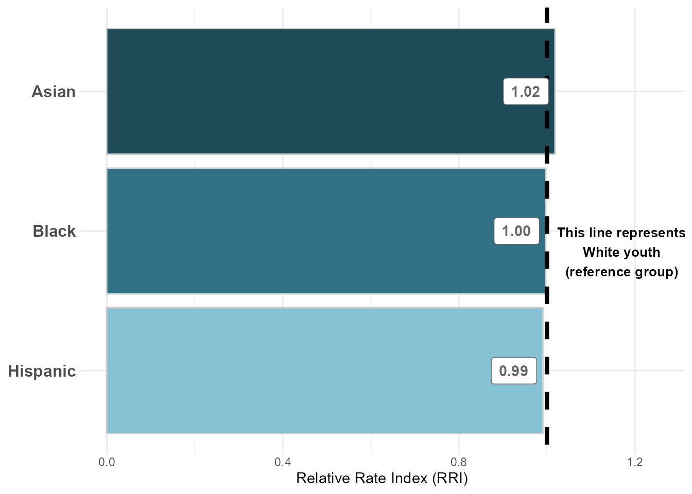{width=85%}
:::
:::


<br>

#### Figure 10: Predicted Probabilities of Diversion by Referral Source


::: {.cell .column-page-right}
::: {.cell-output-display}
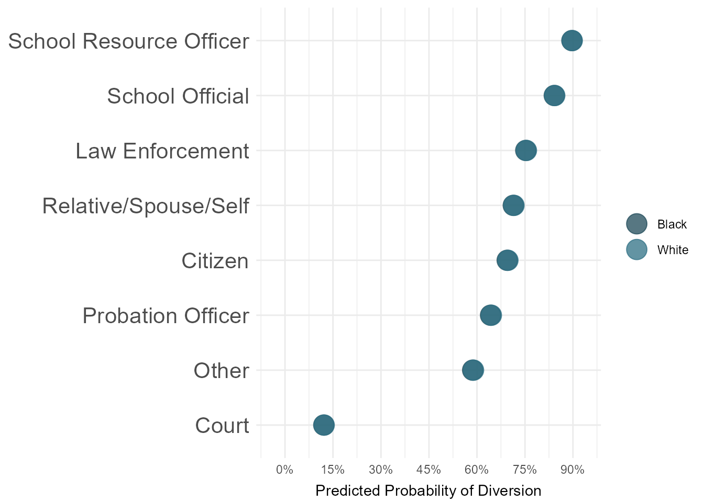{width=85%}
:::
:::


<br>

#### Figure 11: Predicted Probabilities of Diversion by CSU 

**NOTE:** We will likely want to exclude CSU's with small N sizes -- I haven't yet done that. 


::: {.cell .column-page-right}
::: {.cell-output-display}
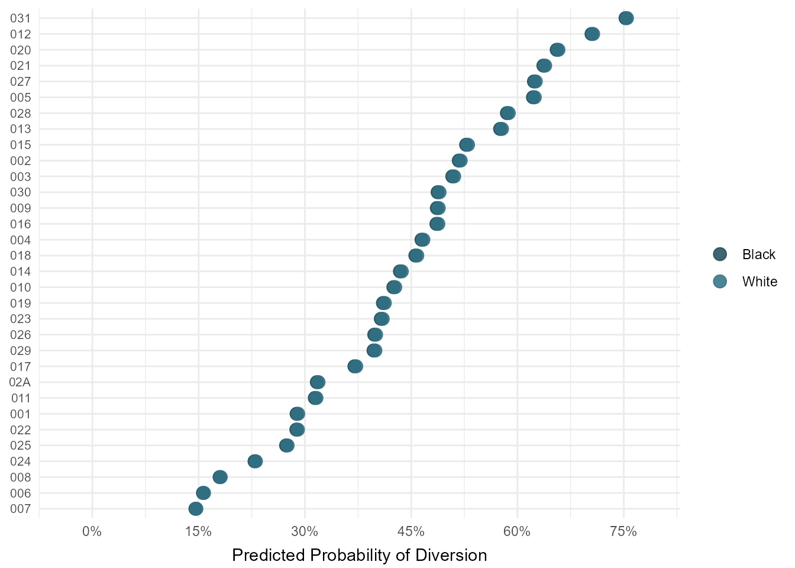{width=85%}
:::
:::


<br>

#### Figure 12: Predicted Probabilities of Diversion by Charge Type 


::: {.cell .column-page-right}
::: {.cell-output-display}
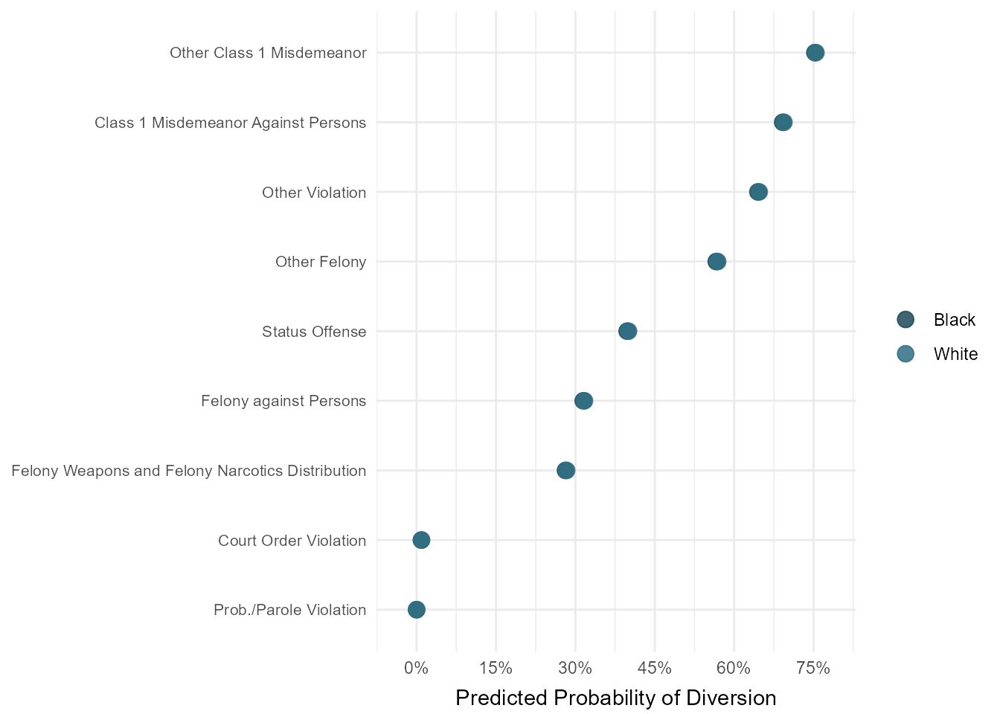{width=85%}
:::
:::


<br>

